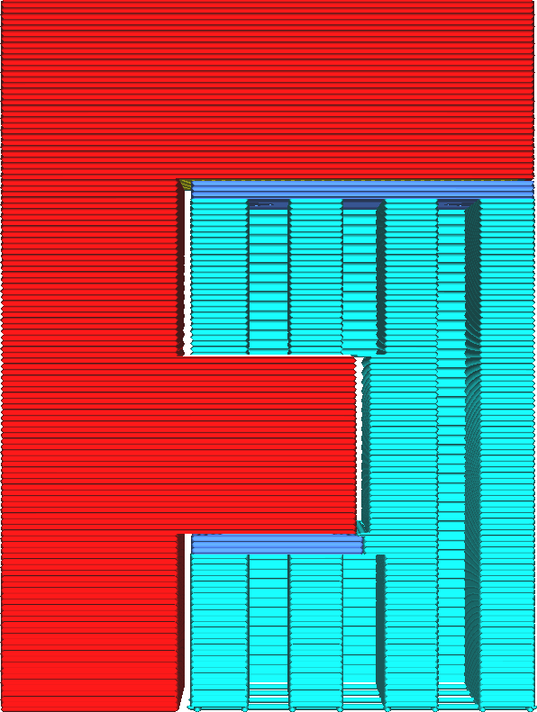

Supportdak inschakelen
====
Het supportdak is een tussenconstructie tussen de support en het model, waarbij het model op de support rust. Het kan worden gebruikt om het model meer of beter te ondersteunen zonder de printtijd aanzienlijk te beïnvloeden. Het supportdak wordt meestal dichter of langzamer geprint.

<!--screenshot {
"image_path": "support_roof_enable.png",
"modellen": [{"script": "f3.scad"}],
"camerapositie": [0, 134, 20],
"instellingen": {
    "support_enable": waar,
    "support_roof_enable": true
},
"kleuren": 64
}-->

Standaard is het supportdak dichter dan de normale support. Dit zorgt voor een betere kwaliteit van de overhang omdat het model geen grote afstanden hoeft te overbruggen. Het verwijderen van support is echter veel moeilijker.

Het dak van het support kan ook geprint worden met een andere extruder dan de rest van de support. Sommige materialen voor printsupport kunnen erg duur en traag zijn om printen. Op deze manier wordt het grootste deel van de support nog steeds geprint met het goedkopere of sneller te printen materiaal, maar het dak dat het gebruik van het supportmateriaal benut, wordt geprint met het materiaal van hogere kwaliteit.