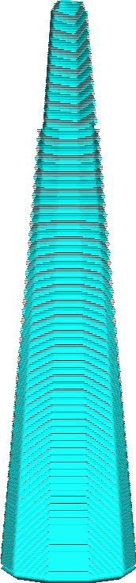

Takdiameter van de boomsupportsstructuur
====
Met deze instelling kunt u de breedte van de takken van de boomsupportsstructuur aanpassen. De hier gegeven breedte is de breedte aan de bovenkant van de takken van de boom. De bovenkant van de tak is dunner en wordt geleidelijk breder naar de onderkant toe, zoals gespecificeerd in de instelling [Hoek van takdiameter van boomsupportstructuur](support_tree_branch_diameter_angle.md).

<!--screenshot {
"image_path": "support_tree_branch_diameter_1_4mm_5.png",
"modellen": [{"script": "lantaarn.scad"}],
"camera_positie": [0, 70, 13],
"instellingen": {
    "support_enable": waar,
    "support_structure": "boom",
    "support_tree_branch_diameter": 1.4,
    "support_tree_branch_diameter_angle": 5
},
"structuren": ["helpers"],
"kleuren": 16
}-->
<!--screenshot {
"image_path": "support_tree_branch_diameter_5mm.png",
"modellen": [{"script": "lantaarn.scad"}],
"camera_positie": [0, 70, 13],
"instellingen": {
    "support_enable": waar,
    "support_structure": "boom",
    "support_tree_branch_diameter": 5,
    "support_tree_branch_diameter_angle": 5
},
"structuren": ["helpers"],
"kleuren": 16
}-->

Bredere takken zijn stabieler en verminderen het risico dat de nozzle over de boom stoot als deze er overheen moet.

Bredere takken sluiten ook sneller op elkaar aan. Dit bespaart wat materiaal, maar het kan er ook toe leiden dat een deel van het model niet meer goed wordt ondersteund, inclusief een deel van de support zelf. Als takken worden samengevoegd, hebben ze geen omtrek meer. Brede takken kunnen het beste worden gecombineerd met een grote [Takafstand van boomsupportstructuur](support_tree_branch_distance.md) of [Dichtheid Supportstructuur](../support/support_infill_rate.md) om delen in het midden van brede takken goed te ondersteunen.

Bredere takken zullen het ook moeilijker hebben om door uw model te navigeren. Dit kan ertoe leiden dat meer support op het model rust dan op de platform. Als gevolg hiervan kan uw model meer littekens hebben na het verwijderen van de ondersteunde structuren.