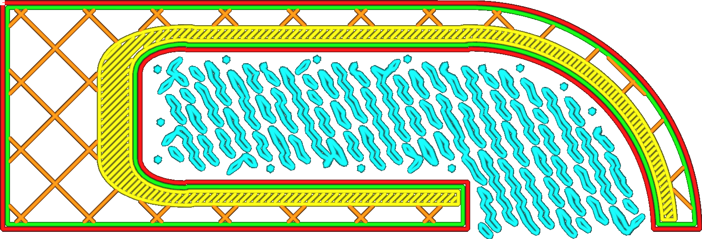

Takafstand van boomsupportsstructuur
====
Deze instelling bepaalt de afstand tussen twee aangrenzende takken waarop de takken de platvorm raken.

<!--screenshot {
"image_path": "support_tree_branch_distance_1_4.png",
"modellen": [
    {
        "script": "gutter_lift.scad",
        "transformatie": ["schaal(0.5)", "roterenZ(-90)"]
    }
],
"camera_positie": [0, 0, 180],
"instellingen": {
    "support_enable": waar,
    "support_structure": "boom",
    "support_tree_branch_distance": 1.4
},
"minimum_laag": 1310,
"laag": 1311,
"kleuren": 64
}-->
<!--screenshot {
"image_path": "support_tree_branch_distance_5.png",
"modellen": [
    {
        "script": "gutter_lift.scad",
        "transformatie": ["schaal(0.5)", "roterenZ(-90)"]
    }
],
"camera_positie": [0, 0, 180],
"instellingen": {
    "support_enable": waar,
    "support_structure": "boom",
    "support_tree_branch_distance": 5
},
"minimum_laag": 1310,
"laag": 1311,
"kleuren": 64
}-->

Om het model te ondersteunen, plaatst de boomsupportsstructuur contactpunten onder het model in een verspringend rasterpatroon. Deze instelling bepaalt in wezen de grootte van dit raster en dus de afstand tussen de takken. Door de oriëntatie van de takken ten opzichte van de (standaard) richting van de skinlijnen, zal de afstand die de skinlijnen moeten overspannen hoogstwaarschijnlijk groter zijn dan deze afstand.

Door de afstand tussen takken te verkleinen, kan een betere kwaliteit overhang worden bereikt, omdat de lijnen die op de support rusten niet zo ver hoeven te overbruggen. De support wordt ook stijver omdat er meer materiaal wordt gebruikt voor het bovenste deel van de support, waardoor de print betrouwbaarder wordt.

Het verkleinen van de afstand tussen takken zorgt er echter ook voor dat de support meer materiaal verbruikt en meer tijd kost om te printen.

Het verkleinen van de afstand tussen takken onder de [Takdiameter van Boomsupportstructuur](support_tree_branch_diameter.md) zorgt ervoor dat de takken samensmelten voordat ze goed kunnen worden gevormd. Dit kan ertoe leiden dat het midden van grote overhangende gebieden niet meer goed wordt ondersteund.