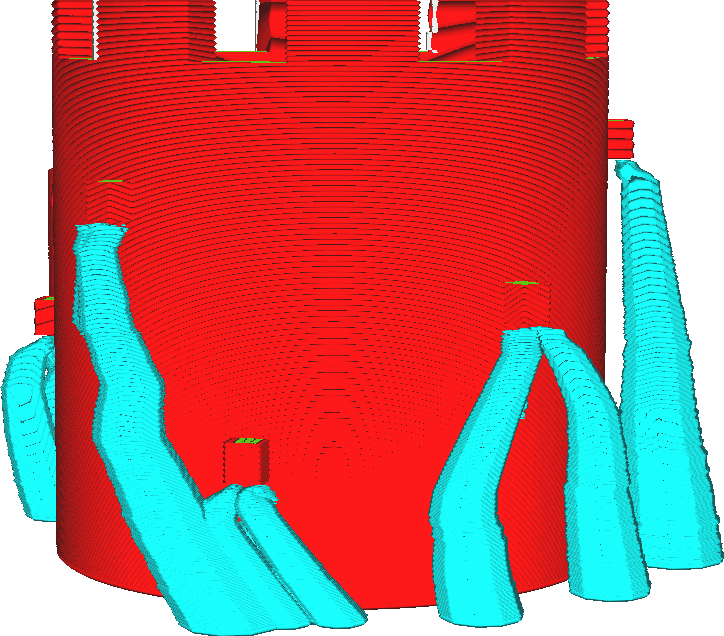

Resolutie bij botsingen van de boomsupportstructuur
====
Een groot nadeel van de boomsupportsstructuur is dat het lang duurt om te berekenen wanneer deze wordt geactiveerd. De meeste berekeningen die nodig zijn voor boomsupport hebben betrekking op het vermijden van botsingen tussen de takken van de boom en het raster. Deze instelling bepaalt de nauwkeurigheid van deze berekeningen om botsingen te vermijden. Een hogere resolutie (lagere nauwkeurigheid) bespaart veel tijd in de berekeningen, maar zorgt er ook voor dat de support gekarteld lijkt wanneer deze zich dicht bij de mesh bevindt.

<!--screenshot {
"image_path": "support_tree_collision_resolution_lo.png",
"modellen": [{"script": "castle_low.scad"}],
"camerapositie": [-128, -63, 30],
"instellingen": {
    "z_seam_position": "rechtsachter",
    "support_enable": waar,
    "support_structure": "boom",
    "support_tree_collision_resolution": 0.2
},
"kleuren": 32
}-->
<!--screenshot {
"image_path": "support_tree_collision_resolution_hi.png",
"modellen": [{"script": "castle_low.scad"}],
"camerapositie": [-128, -63, 30],
"instellingen": {
    "z_seam_position": "rechtsachter",
    "support_enable": waar,
    "support_structure": "boom",
    "support_tree_collision_resolution": 0.02
},
"kleuren": 32
}-->

De technische achtergrond van deze instelling is als volgt. Om botsingsresolutie van de boomsupportstructuur met het geprinte object te voorkomen, berekent Cura 3-dimensionale volumes die de middelpunten van de takken van de boom niet mogen doordringen. Zo'n volume wordt berekend voor elke mogelijke diameter van de takken van de boom, wat veel tijd kost. Het aantal mogelijke takdiameters neemt dramatisch toe met toenemende boomhoogte en met grote waarden voor [Hoek van takdiameter van boomsupportstructuur](support_tree_branch_diameter_angle.md). Om deze reden wordt de diameter afgerond op het dichtstbijzijnde veelvoud van deze resolutie-instelling. Op sommige punten langs de hoogte van de boom wordt de botsing die de tak moet vermijden echter beperkt tot het dichtstbijzijnde patroon van een takdiameter, waardoor de tak plotseling meer bewegingsruimte krijgt. Hierdoor lijkt de boom hoekig.

Als u deze instelling verhoogt, neemt de snede in Cura minder tijd in beslag. Hierdoor wordt de support ook hoekiger, wat de sterkte aantast en de kans vergroot dat de support tijdens het printen afbreekt, wat tot printfalen kan leiden.