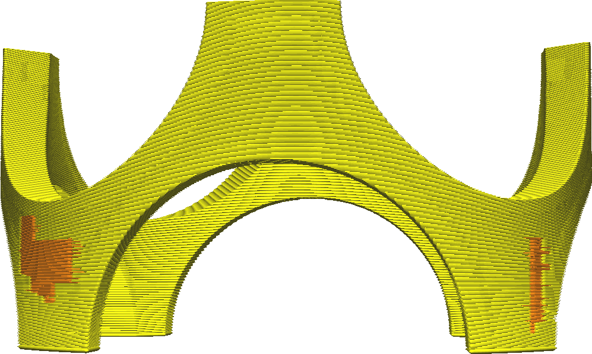

Uitbreidingsafstand van onderste skinlaag
====
Hiermee kunt u de onderste lagen van de print breder of dunner maken in horizontale richting. Normaal gesproken worden de dichte lagen alleen gemaakt over delen met lucht eronder, maar met deze instelling kunt u de lagen iets verder in horizontale richting uitrekken, waardoor de skin aan de aangrenzende wanden blijft kleven en gaten in de skin opvult.

* Als u kleine gaatjes heeft in de onderste lagen van de skin (gaatjes die worden opgevuld met het opvulpatroon), kunt u deze waarde iets hoger instellen om ze te sluiten. Hierdoor kan de printer de onderste regels continu printen, wat de stabiliteit sterk verbetert.
* Als je een onderkant hebt die niet direct op de platformligt, komen er wanden onder de buitenskin. Dit verbetert de hechting tussen de onderlagen en de aangrenzende wanden doordat de onderlagen direct op de wanden worden geprint.
* Als u deze instelling op een negatieve waarde zet, wordt de breedte van de onderste lagen kleiner en worden ze vervangen door een vulling. Dit kan wat printtijd besparen, maar gaat ten koste van de sterkte.

**Vanwege technische beperkingen kunt u deze instelling niet verlagen tot onder de waarde van [Verwijderingsbreedte onderste skinlaag](bottom_skin_preshrink.md). Verhoog de waarde [Verwijderingsbreedte onderste skinlaag](bottom_skin_preshrink.md) om meer skin te verwijderen.**