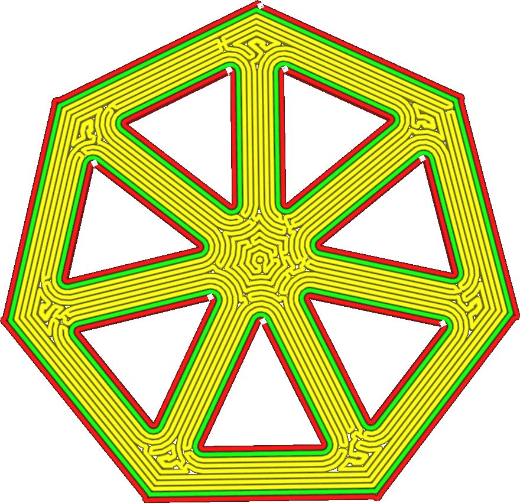

Boven-/onderkant Polygonen verbinden
====
Wanneer u een boven-/onderconcentrisch patroon gebruikt (een patroon dat bestaat uit gesloten contouren, ook wel polygonen genoemd), verbindt u alle contouren met elkaar om een enkel pad te vormen.

<!--screenshot {
"image_path": "connect_skin_polygons_original.png",
"modellen": [
    {
        "script": "web.scad",
        "scad_params": ["inzet=1", "line_width=4"]
    }
],
"camerapositie": [10, 5, 111],
"instellingen": {
    "top_bottom_pattern": "concentrisch",
    "connect_skin_polygons": false
},
"kleuren": 64
}-->
<!--screenshot {
"image_path": "connect_skin_polygons_enabled.png",
"modellen": [
    {
        "script": "web.scad",
        "scad_params": ["inzet=1", "line_width=4"]
    }
],
"camerapositie": [10, 5, 111],
"instellingen": {
    "top_bottom_pattern": "concentrisch",
    "connect_skin_polygons": true
},
"kleuren": 64
}-->

Hierdoor worden nozzle verplaatsingen gereduceert. Hierdoor ontstaan echter nieuwe scherpe hoeken waarin de nozzle sterk moet accelereren en vertragen, wat de winst in printtijd teniet doet. Het kronkelende patroon zal ook aan de buitenkant zichtbaar zijn, wat een interessant visueel effect geeft.

De contouren gegenereerd door [Aantal Extra Wandlijnen Rond Skin](../top_bottom/skin_outline_count.md) zijn niet met elkaar verbonden.