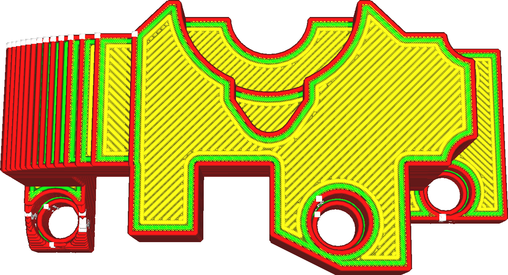

Strijkdoorvoer
====
Strijken maakt extra lijnen in het oppervlak, wat technisch gezien over-extrusie is. Deze instelling bepaalt hoeveel er in deze extra laag wordt geëxtrudeerd. De stroming is nodig om gaten in het oppervlak op te vullen.

<!--screenshot {
"image_path": "ironing_enabled_enabled.png",
"modellen": [
    {
        "script": "dial_brace.scad",
        "transformatie": ["schaal(0.5)"]
    }
],
"camerapositie": [0, 14, 83],
"instellingen": {
    "laaghoogte": 0.2,
    "ironing_enabled": true
},
"kleuren": 64
}-->
<!--screenshot {
"image_path": "ironing_flow.png",
"modellen": [
    {
        "script": "dial_brace.scad",
        "transformatie": ["schaal(0.5)"]
    }
],
"camerapositie": [0, 14, 83],
"instellingen": {
    "laaghoogte": 0.2,
    "strijken_enabled": waar,
    "ironing_flow": 20
},
"kleuren": 64
}-->

U moet deze instelling hoog genoeg zetten om de druk op nozzle te behouden. Deze print moet de gaten aan de bovenkant opvullen. Als u een zeer ruw oppervlak heeft (vanwege het pillowing effect of te snel printen), moet u deze instelling mogelijk verhogen.