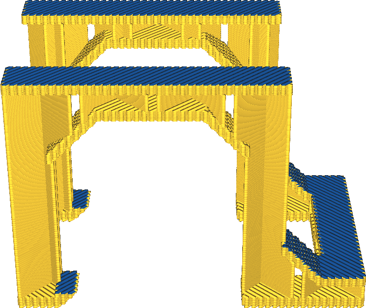

Extruder bovenskin
====
Voor printers met meerdere extruders wordt hier de extruder geselecteerd die moet worden gebruikt voor het printen van het oppervlak.

<!--screenshot {
"image_path": "roofing_extruder_nr.png",
"modellen": [
    {
        "script": "question_stick_clip.scad",
        "transformatie": ["schaal(0.5)"]
    }
],
"camerapositie": [0, -90, 60],
"instellingen": {
    "wall_line_count": 0,
    "skin_outline_count": 0,
    "roofing_layer_count": 1,
    "roofing_extruder_nr": 1
},
"color_scheme": "materiaal_kleur",
"kleuren": 32
}-->

Zo kun je het oppervlak een andere kleur of materiaal geven. Merk op dat de extruder voor de wanden niet wordt gewijzigd door deze instelling, dus er zal nog steeds een rand rond de bovenkant zijn.

Behalve dat je de top een andere kleur geeft, kun je de top ook met een ander materiaal printen. Hiermee kunnen verschillende effecten worden bereikt:
* Print de boven- en buitenwand in PLA en print de rest met een stijver materiaal om een stevig object te krijgen dat er ook nog eens goed uitziet.
* De bovenkant is geprint met TPU, de rest met een harder materiaal voor een zacht, gripvast oppervlak.
* Druk de bovenkant af met een materiaal dat gladder is dan het zwaardere materiaal dat je nodig hebt voor de binnenkant van het model als je iets over het oppervlak wilt laten glijden.

**Als het materiaal voor de bovenkant niet goed hecht aan het onderliggende materiaal, zal het na het printen gaan delamineren. Wees vooral voorzichtig met materialen met een hoge krimpfactor.**