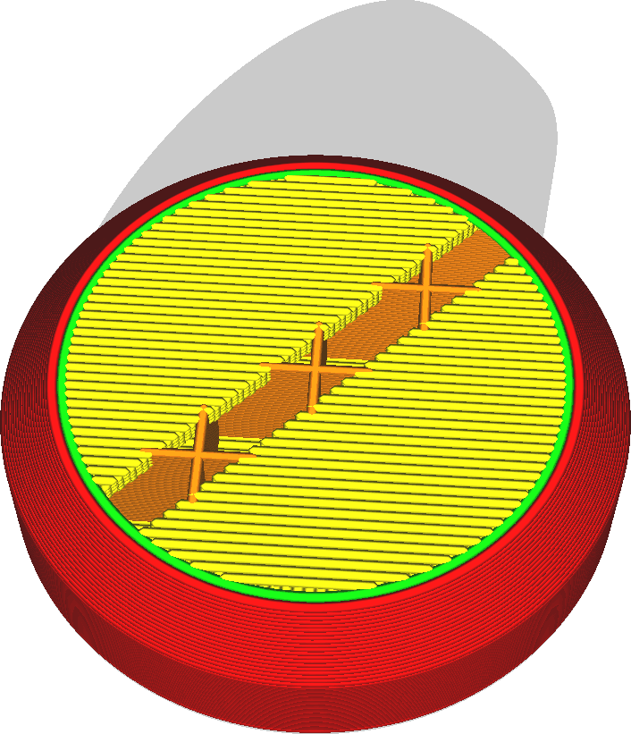
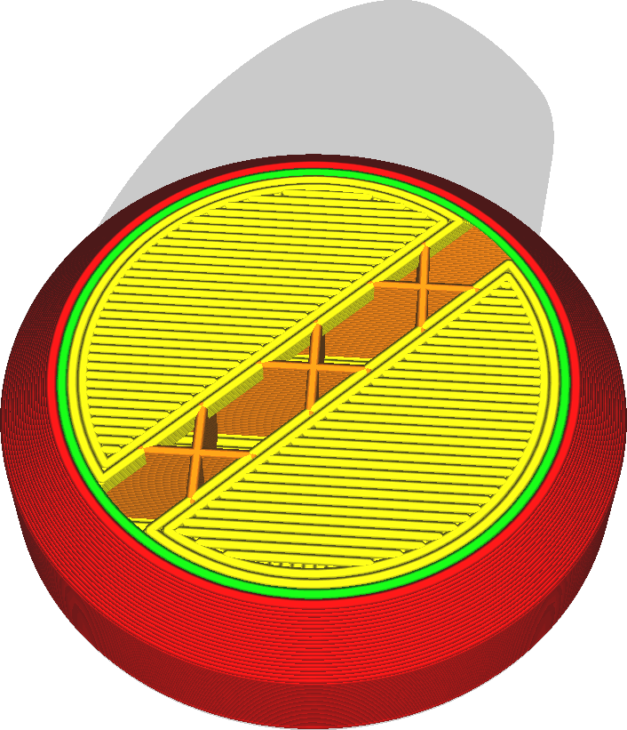

Aantal Extra Wandlijnen Rond Skin
====
Als u de boven- en onderkant print met het lijnenpatroon, kan de buitenrand van de skingebieden nog worden geprint met enkele concentrische lijnen. Dit is anders dan het printen van een extra wand omdat de extra wand van de skin ook tussen de skin en de vulling wordt geplaatst.

<!--screenshot {
"image_path": "skin_outline_count_0.png",
"modellen": [
    {
        "script": "stempel.scad",
        "transformatie": ["schaal(0.5)"]
    }
],
"camerapositie": [38, 38, 99],
"instellingen": {"skin_outline_count": 0},
"laag": 115,
"kleuren": 64
}-->
<!--screenshot {
"image_path": "skin_outline_count_2.png",
"modellen": [
    {
        "script": "stempel.scad",
        "transformatie": ["schaal(0.5)"]
    }
],
"camerapositie": [38, 38, 99],
"instellingen": {"skin_outline_count": 2},
"laag": 115,
"kleuren": 64
}-->

Normaal gesproken kunnen de lijnen van de buitenskin eindigen in de dunne vulling. Je eindpunten zullen dan een beetje doorzakken. Als er extra wanden in de skin zitten, zal de printer eerst een rand rond de skin printen waar de normale skinlijnen aan kunnen worden bevestigd. De buitenskin zakt dan bij de eindpunten minder door. Uiteindelijk komt dit de kwaliteit van de bovenkanten enigszins ten goede.