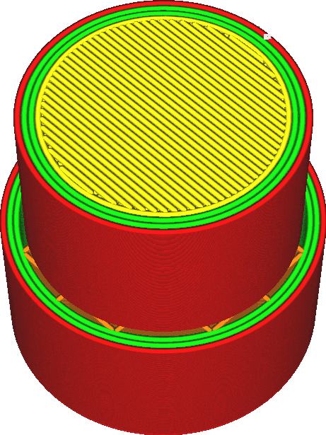

Verwijderingsbreedte skin
====
Met deze instelling worden zeer dunne stroken skin verwijderd en vervangen door vulmateriaal.

De skin wordt alleen verwijderd als er vulmateriaal naast ligt. De buitenste schil wordt dus niet helemaal aan de boven- of onderkant van de print verwijderd, ook niet als deze erg dun is.

De skin wordt meestal gegenereerd waar deze zich verticaal in de buurt van de boven- of onderkant van het object bevindt. Dit hoeft niet overal. Verticale wanden zijn meestal sterk genoeg dat, hoewel de skin normaal gesproken aan de hoekpunten van de verticale wanden moet worden bevestigd, u deze instelling met deze instelling kunt weglaten. Dit bespaart printtijd en materiaal.

Voor de meeste printen is het handig om de lijnbreedte in te stellen op 1 of 2 om de printtijd te verkorten. Bovendien, wanneer de skin te dun wordt om printen, laat Cura een opening achter waar de skin had moeten zijn (maar te klein was). De vulling hecht dan niet goed aan de wanden. Als [Vul gaten tussen wanden](../shell/fill_perimeter_gaps.md) is aangevinkt, worden deze gaten opgevuld, maar deze opvulmodus kost meer tijd om printen dan de normale shell. Door deze instelling te verhogen naar ten minste [Lijnbreedte Boven-/onderkant](../resolution/skin_line_width.md) wordt dit voorkomen.

Als u de instelling te veel verhoogt, kunnen er openingen ontstaan ​​aan de boven- en onderkant waar de vulling wordt weergegeven. Wees vooral voorzichtig bij modellen met dunne stroken die een dunne strook skin nodig hebben.

