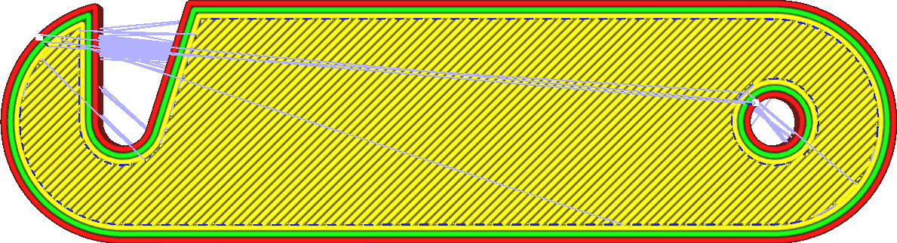
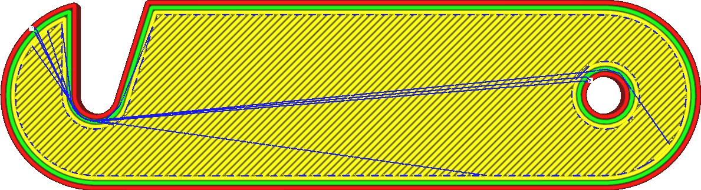

Combing-modus
====
Door te combineren wordt voorkomen dat de wanden van de print worden overschreden wanneer de printer van de ene naar de andere locatie gaat. Het oversteken van de wanden heeft de neiging een litteken op het oppervlak achter te laten wanneer de hete nozzle de print verlaat of binnengaat, wat in het algemeen ongewenst is.

Alleen combineren zorgt er alleen voor dat nozzle de wanden vermijdt terwijl het zich door het binnenste van het model verplaatst. De functie [Geprinte delen mijden tijdens bewegingen](travel_avoid_other_parts.md) zorgt er echter voor dat de nozzle ook objecten buiten het gebied vermijdt.

<!--screenshot {
"image_path": "retraction_combing_off.png",
"modellen": [
    {
        "script": "safety_lock.scad",
        "scad_params": ["lengte=40"]
    }
],
"camerapositie": [0, 0, 120],
"structuren": ["reizen", "helpers", "shell", "infill", "starts"],
"settings": {"retraction_combing": "off"},
"minimum_laag": 2,
"kleuren": 64
}-->
<!--screenshot {
"image_path": "retraction_combing_on.png",
"modellen": [
    {
        "script": "safety_lock.scad",
        "scad_params": ["lengte=40"]
    }
],
"camerapositie": [0, 0, 120],
"structuren": ["reizen", "helpers", "shell", "infill", "starts"],
"settings": {"retraction_combing": "all"},
"minimum_laag": 2,
"kleuren": 64
}-->

Als er een pad van het begin naar het eindpunt is dat door het object gaat zonder wanden te raken, wordt dat pad genomen zonder inspringen. Als de start- en eindpunten zich op volledig gescheiden paden bevinden, beweegt de nozzle eerst naar de positie waar de twee delen het dichtst bij zijn, trekt vervolgens optioneel terug (als [Intrekken Inschakelen](retraction_enable.md)), reist naar het doelpad , optioneel duwt terug en beweegt dan door het nieuwe deel naar zijn eindbestemming. In beide delen, het vermijden van het aanraken van de wanden tijdens het verplaatsen door het interieur. Bij het verplaatsen van onderdeel naar onderdeel worden onderdelen alleen vermeden als de instelling [Geprinte delen mijden tijdens bewegingen](travel_avoid_other_parts.md) is ingeschakeld.

Het doel van combineren is om te voorkomen dat de wanden van het object binnendringen en het aantal sporen dat op het oppervlak achterblijft te verminderen. Het vermindert ook het stringing dat zichtbaar is aan de buitenkant, omdat filament dat tijdens het reizen ontsnapt, aan de binnenkant van het model wordt geplaatst. Door te combineren wordt de baan echter ook langer. Soms moet hij een grote omweg maken.

Er zijn vier opties in de vervolgkeuzelijst voor deze instelling:
* **Uit**: Combineren is uitgeschakeld. Routes worden altijd direct naar de bestemming geleid. Als er geen wanden worden aangetast, wordt er niet verplaatst.
* **Alle**: nozzle raakt de wanden niet terwijl het door de binnenkant van de print gaat, zoals hierboven beschreven.
* **Niet in de buitenskin**: Indien mogelijk raakt nozzle de buitenskin niet. Dit kan de kras op de bovenkant van de print verminderen als nozzle langs de wanden beweegt in plaats van door de skin. In sommige gevallen kan de nozzle echter niet ontwijken en moet het worden ingetrokken, anders zou het de buitenskin beschadigen.
* **Binneninvulling**: deze modus is de strengste van allemaal en laat alleen combineren via de vulling toe. Dit voorkomt dat nozzle zowel de binnen- als de buitenwand raakt en ook de buitenskin. Soms kan nozzle, wanneer het de binnenwanden raakt, aan de buitenkant nog steeds zichtbaar zijn omdat de buitenstraal van nozzle breder is dan de wanden. Dit voorkomt dit effect. Het moet echter vaker worden ingetrokken, omdat er vaak geen manier beschikbaar is.