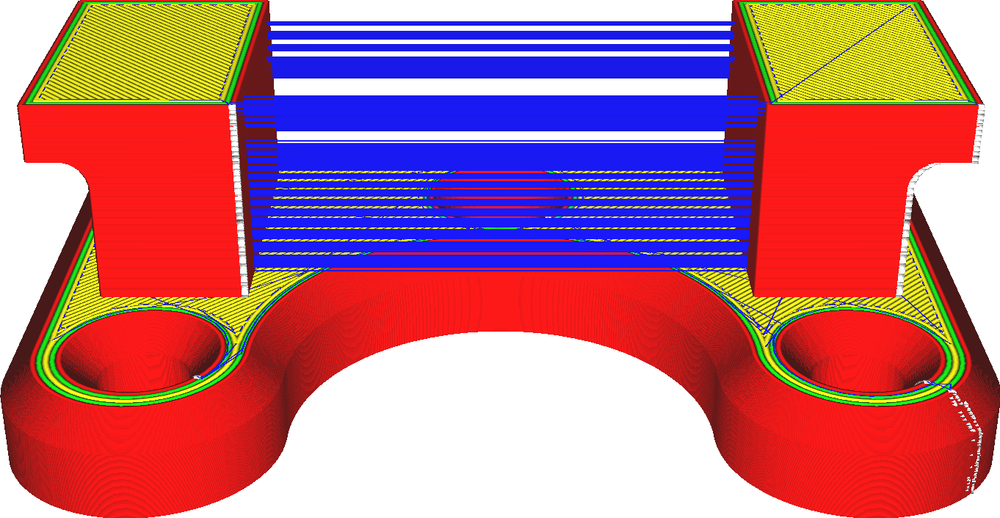
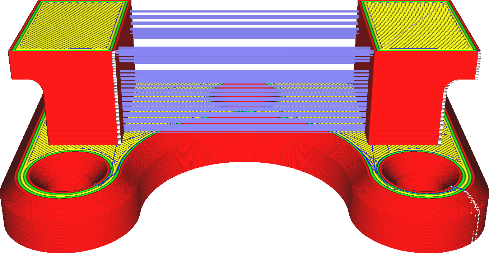

Intrekken Inschakelen
====
Wanneer een 3D-printer stopt met het printen van materiaal, stopt het materiaal niet meteen met uitstromen uit het uiteinde van de nozzle. In de nozzle blijft een restmateriaal achter, dat onder druk staat en daardoor nog even blijft stromen. Om de materiaalstroom echt te stoppen, moet de printer het materiaal uit de nozzleopening intrekken. Dit is nodig om schone verplaatsingen zonder stringing mogelijk te maken.

<!--screenshot {
"image_path": "retraction_enable_disabled.png",
"modellen": [{"script": "wire_mount.scad"}],
"camerapositie": [0, -115, 68],
"structuren": ["reizen", "helpers", "shell", "infill", "starts"],
"settings": {"retraction_enable": false},
"minimum_laag": 2,
"kleuren": 64
}-->
<!--screenshot {
"image_path": "retraction_enable_enabled.png",
"modellen": [{"script": "wire_mount.scad"}],
"camerapositie": [0, -115, 68],
"structuren": ["reizen", "helpers", "shell", "infill", "starts"],
"settings": {"retraction_enable": true},
"minimum_laag": 2,
"kleuren": 64
}-->

Het intrekken vindt plaats op routes die bijzonder gevoelig zijn voor stringing. verplaatsingen die alleen door de vulling of van support naar support lopen, worden meestal niet geprint. Er is ook een limiet aan het aantal keren dat het materiaal kan worden ingetrokken door de instellingen [Maximaal Aantal Intrekbewegingen](retraction_count_max.md) en [Minimal Afstandsgebied voor Intrekken](retraction_extrusion_window.md).

Intrekken heeft belangrijke voordelen, maar ook enkele nadelen:
* Het vermindert het stringing aanzienlijk. Geen draden meer tussen verschillende delen van de print.
* Vermindert aanzienlijk het aantal en de grootte van klodders op het oppervlak waar nozzle de omtrek van een onderdeel binnenkomt.
* Intrekken duurt iets langer.
* Bij het intrekken wordt de materiaalstroom onderbroken. Dit heeft een negatieve invloed op de maatnauwkeurigheid, strepen en onder-extrusie.
* Het filament kan verslijten als het te vaak wordt ingevoerd, waardoor de feeder het materiaal niet meer kan vasthouden.

**Flexibele materialen zijn moeilijker te voeden omdat het filament uitrekt door eraan te trekken in plaats van uit nozzle te trekken. Het kan erg tijdrovend en relatief ineffectief zijn om dergelijke materialen te laten intrekken.**