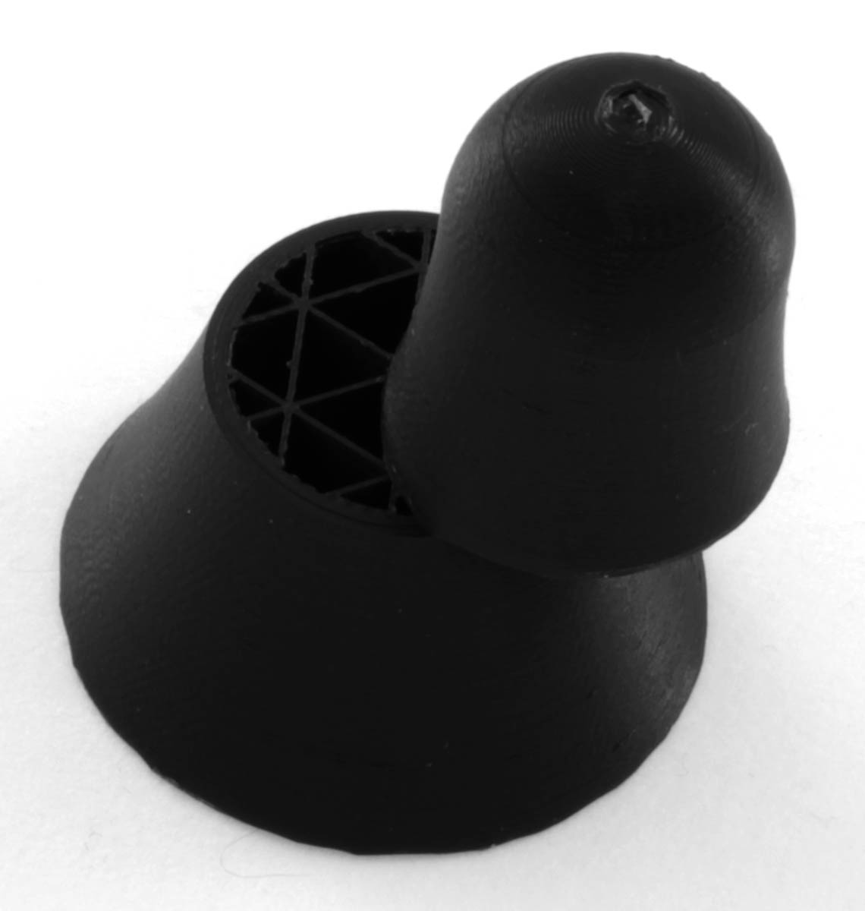

Laagverschuiving
====
Laagverschuiving treedt op wanneer de lagen van een print niet goed op elkaar zijn gestapeld. Als om wat voor reden dan ook de printkop wordt verschoven tijdens het printen van een laag, zal de printer doorgaan met printen met een offset. Hierdoor wordt de bovenkant van de print verschoven ten opzichte van de onderkant.

Oorzaken
----
Er zijn twee soorten laagverschuivingen.

Eén type laagverschuiving wordt veroorzaakt doordat de printkop ergens onderweg wordt belemmerd. Hierdoor verschuift de laag op een punt in het midden van de print. Dit kan gebeuren wanneer de gebruiker iets in het printportaal plaatst tijdens het printen of wanneer de printkop een ander object raakt tijdens het printen in [Printvolgorde](../blackmagic/print_sequence.md). Als de printkop ergens tegenaan botst en niet kan bewegen, slaan de motoren een paar stappen over. Als de printer dit niet kan detecteren, zal hij gewoon doorgaan zonder deze beweging en de rest van de print uitstellen.

Een ander type laagverschuiving treedt op wanneer de printtaak zelf te veel kracht op de printkop uitoefent, waardoor de stappenmotoren van de printer stappen verliezen. Elke keer dat er stappen verloren gaan, wordt de druk van daaruit verschoven. Doorgaans komen de verloren stappen in elke laag op dezelfde plaats voor vanwege een bijzonder scherpe hoek. Het resultaat is dat alle of een specifiek deel van de prent scheef lijkt.

Preventie
----
Het eerste type laagverschuiving wordt meestal niet voorkomen door de instelling van Cura. Cura is ontworpen om te voorkomen dat de zijkanten van het printvolume worden geraakt. Als de grootte van het printvolume correct is ingevoerd in Cura, mag het geen g-code genereren die buiten het printbare volume gaat. Mocht dit toch het geval zijn, dan kunt u in het dialoogvenster Apparaatinstellingen onder Printerbeheer de grootte van het printvolume aanpassen om een ​​correctie aan te brengen. Zorg er ook voor dat er geen obstakels in het printvolume zijn die de printkop of het bewegingssysteem tegen kunnen komen tijdens het printen. Printers kunnen dit meestal niet herkennen en blijven daarom vanuit een verschoven positie printen. Zoek naar kabels die in de weg zitten en zorg ervoor dat: Zorg ervoor dat alle kabels lang genoeg zijn om alle printerbewegingen mogelijk te maken. Zorg er ook voor dat de stepper-stuurprogramma's op de printplaat van de printer niet oververhit raken, wat een tijdelijke storing kan veroorzaken.

Het andere type laagverschuiving dat continu door de print heen optreedt, wordt waarschijnlijk veroorzaakt door te veel kracht op uw bewegingssysteem. Hier zijn meerdere mogelijke oplossingen voor.

Eerst moet je naar je hardware kijken. Zijn de riemen strak? Als dat niet het geval is, kunt u een manier zoeken om ze vast te zetten. Sommige printers hebben instelbare motorposities waarmee u de riemen kunt spannen. Slippen de katrollen? Draai voor de zekerheid de schroeven op de riemschijven weer vast. Een veelvoorkomend elektrisch probleem is dat de motoren niet genoeg vermogen krijgen om genoeg kracht te genereren voor een scherpe beweging. Controleer in dit geval of de voeding voldoende is.

Als de hardware goed werkt, kun je Cura ook instellen om de hardware rustig aan te doen. Hier zijn enkele instellingen die u kunt aanpassen:
* Lagere [Printschok](../speed/jerk_print.md). Hierdoor vertraagt ​​de printkop voordat een hoek wordt geprint. Dit verzacht de bocht, het gaat zachtjes de bocht in in plaats van hard te draaien.
* Verlaag de [Printacceleratie](../speed/acceleration_print.md). Hierdoor vertraagt ​​de printkop zachter en langer voor een curve (hoewel de snelheid waarmee de printkop de apex van de curve doorloopt niet wordt beïnvloed; dat is het doel van de schokaanpassing).
* Verlaag de [Bewegingssnelheid](../speed/speed_travel.md). Dit vermindert de kracht waarmee de nozzle over reeds geprinte delen schuift.
* Schakel [Z-sprong wanneer ingetrokken](../travel/retraction_hop_enabled.md) in. Dit voorkomt dat de printkop eerder geprinte delen raakt als deze door vlekken of kromtrekken een beetje omhoog komen.