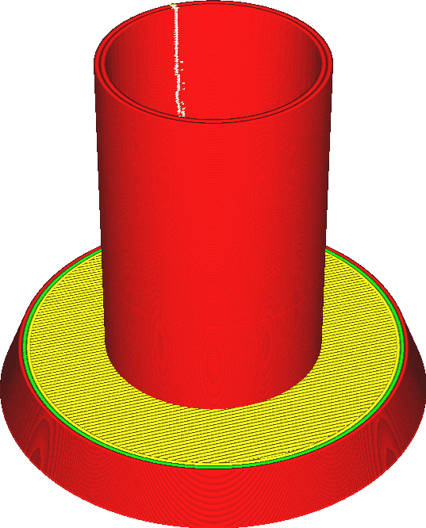

Modo de superfície
====
Normalmente, a Cura criou seções transversais de todos os triângulos da sua malha.Esses segmentos de linha estão ligados para formar loops.Os loops que não estão fechados serão rejeitados.

Este parâmetro controla o que será feito com esses cachos não isolados.Se esse parâmetro estiver definido em "Normal", eles serão rejeitados.Se estiver definido em "superfície", todas as seções transversais serão impressas na forma de contornos.Se o parâmetro estiver definido em "Ambos", os contornos fechados serão impressos normalmente, mas os contornos não tripulados serão impressos separadamente na forma de paredes adicionais.

As superfícies adicionais que serão impressas incluem apenas superfícies verticais na forma de linhas simples.Não há técnica de enchimento para superfícies horizontais, porque as superfícies não são polígonos fechados.Eles não podem ser preenchidos, pois não há interior.Não pode ser de cima, abaixo, preencher ou suportes.Apenas linhas simples.

As superfícies adicionais serão impressas como se fossem paredes externas, portanto, serão afetadas pela velocidade de impressão das paredes externas, a largura das linhas etc.Ele também imprimirá essas superfícies usando uma linha que é precisamente centrada na superfície, em vez de alinhar a linha ao longo do interior do modelo.Isso significa que ele se estende com uma metade da metade de cada lado da superfície.Isso acontece porque é ambíguo saber qual lado da superfície é o interior do modelo.Sua pegada não será exata no nível dimensional.Se, como na captura de tela acima, a superfície adicional estiver alinhada com uma superfície normal e sólida, e você usar a opção "Os dois" para completar as paredes ausentes, as camadas não serão alinhadas adequadamente.

** Se você imprimir volumes normais e superfícies adicionais, não esqueça que os volumes serão impressos com a parede externa completamente dentro do volume.As superfícies adicionais são impressas com a linha centrada na superfície, com metade da largura da linha de cada lado.Se uma superfície adicional estiver alinhada na superfície de um volume fechado, como nas imagens acima, a superfície será deslocada por meia linha.Afinal, a superfície adicional não tem interior em relação a se mover. **