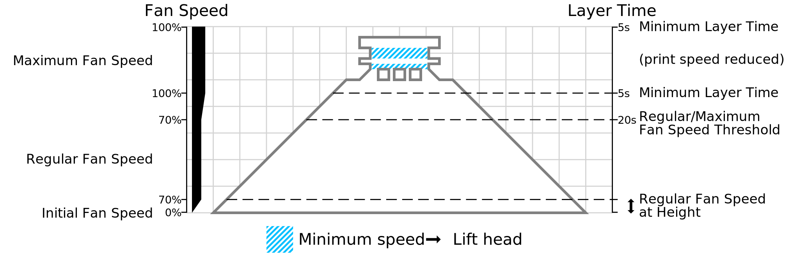

Velocidade regular do ventilador na altura
=====

A velocidade do ventilador começa no valor do parâmetro [velocidade inicial dos ventiladores](cool_fan_speed_0.md) no início da impressão.Durante as primeiras camadas de impressão até atingir a altura especificada neste parâmetro, a velocidade do ventilador será gradualmente aumentada para [velocidade regular do ventilador](cool_fan_speed_min.md).

Normalmente, a velocidade inicial do ventilador é consideravelmente reduzida porque a camada inicial deve permanecer quente durante a impressão.Se a camada inicial esfriar, o material começará a [deformar](../solucionar problemas/warping.md).A primeira camada vence da bandeja de impressão, o que faz com que a impressão falhe.No entanto, se a segunda camada esfriar muito rapidamente, continuará encolhendo e, por atrito de cisalhamento, puxará a primeira camada para cima, o que também terá a impressão.O objetivo desta configuração é permitir a impressão de várias camadas com uma menor velocidade de ventilação.Dessa maneira, o dendulamento esquerdo pode ser evitado até que a impressão tenha rigidez suficiente para resistir à perseguição à esquerda.

O simples fato de reduzir a velocidade do ventilador durante as primeiras camadas criaria uma variação súbita na velocidade do ventilador que seria visível na qualidade da superfície da impressão final.Isso cria um fenômeno de bandas, visível na impressão.Em vez disso, a velocidade do ventilador é gradualmente modificada para atingir a velocidade normal do ventilador.

* O aumento desse parâmetro pode melhorar a adesão à plataforma de impressão.
* Reduza esse ajuste se vir problemas de pernas de elefante ou escorrer.
* Se a sua bandeja de impressão for aquecida a uma temperatura alta, pode ser necessário reduzir essa configuração para evitar pernas ou vazões de elefantes.