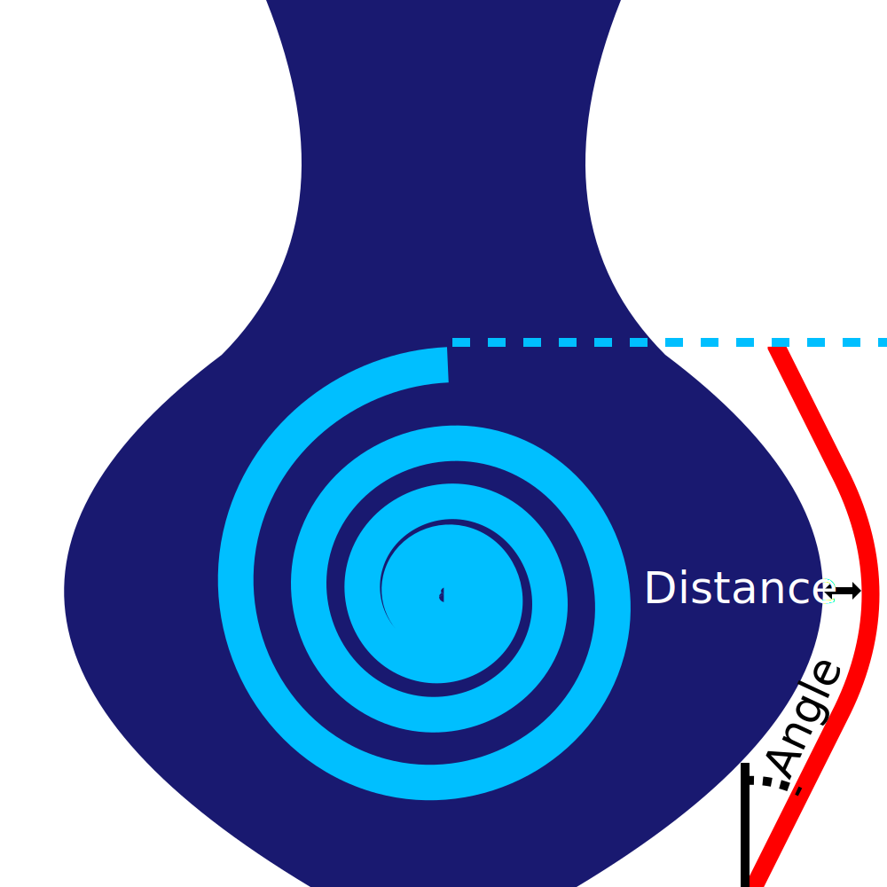

Ângulo de escudo suinta
====
O escudo escorrendo seguirá a forma do modelo.Ele deve permanecer próximo, se não a jornada entre o escudo e o modelo terá sucesso do novo material.Mas o modelo pode ter superfícies horizontais, que criariam saliências íngremes no escudo escorrendo.Esse ajuste limita a inclinação do escudo escorrendo para que não colapse.

* Um valor de 0 torna o bloco suintor completamente vertical em toda a forma.Quanto menor o ângulo, mais estável o escudo.
* Um valor de 90 significa que o escudo anti -ajustado segue exatamente o modelo.Quanto maior o ângulo, melhor o escudo anti -Up evitará escorrer no modelo.

Embora seja teoricamente lógico usar aqui um valor semelhante ao do [ângulo de suporte de suporte](../Support/Support_angle.md), o escudo escorrendo é apenas uma linha simples.Essa linha única é menor que o seu modelo e mais sujeita à esquerda -com a ponta.É bom usar um ângulo ligeiramente menor do que o que normalmente seria impresso no seu modelo, para impedir que o escudo escorrendo se dividisse.