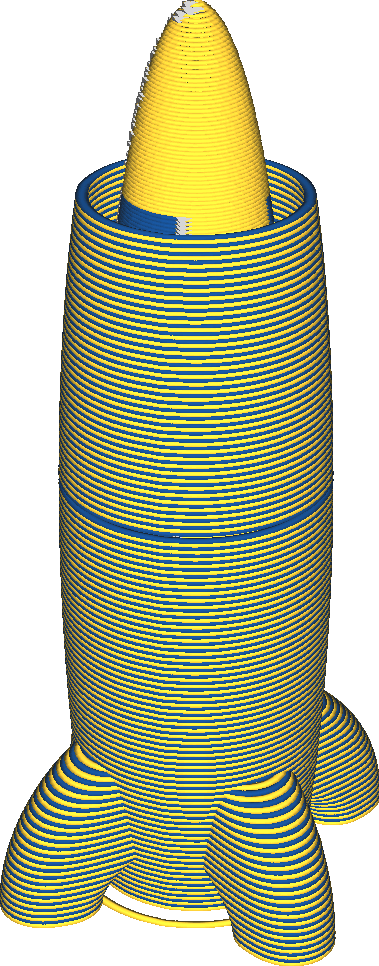

Ative o escudo de processamento
====
Durante a impressão com várias extrusoras, as extrusoras inativas às vezes ainda contêm um pouco de matéria.Se os bicos ainda estiverem quentes, esse material tende a escorrer.Esse é o problema que o escudo anti -fi deve evitar.É uma borda ao redor do objeto que mantém escorrendo sob o bico.

O escudo anti -fed será impresso até a altura da mudança mais alta da extrusora.Além dessa altura, nenhum bico será movido na impressão após estar no modo de espera, para que não seja necessário imprimir um escudo anti-tipo.O escudo de proteção do suor será impresso com a extrusora que começa em uma camada.Essa extrusora alternará cada camada, que é perigosa ao trabalhar com dois materiais diferentes que não grudam bem um ao outro.No entanto, a impressão subsequente, quando a outra extrusora ativa, destrói em grande parte o efeito do escudo anti -file.

O escudo escorrendo é bom o suficiente para quebrar ou cortar facilmente e mantém a distância do seu modelo para poder removê -lo sem deixar cicatrizes na superfície.