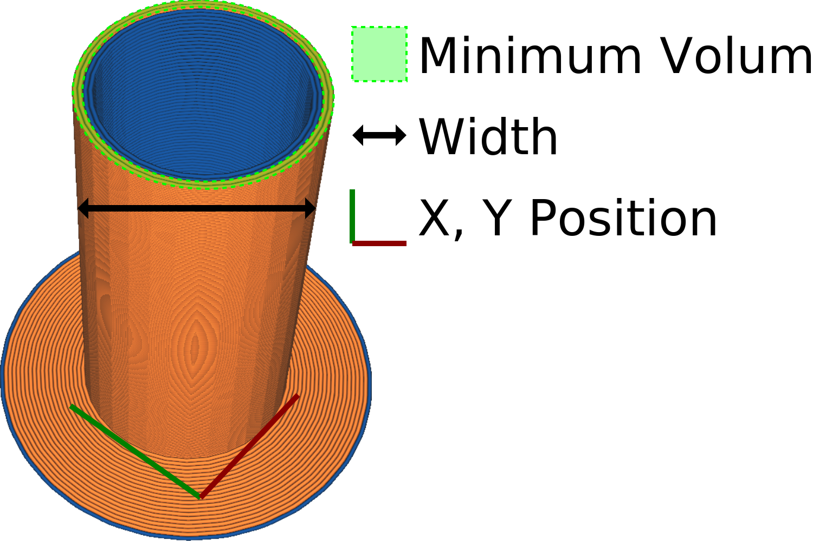

Ative a torre inicial
====
Este sistema imprime uma torre em sua bandeja de impressão com uma mistura de materiais.A torre deve ser jogada, mas é usada para iniciar o material após cada mudança de extrusora.

Enquanto outras extrusoras imprimem, acontece que um bico escorrendo do material, deixando a sala do bico vazio da matéria.É essencial iniciar o material posteriormente, caso contrário, o material ainda não passará corretamente no início.

A torre de priming consiste em um envelope externo que é totalmente impresso com uma extrusora, cada camada.Isso é necessário para garantir a estabilidade da torre, mas às vezes será necessário usar interruptores adicionais para certas impressões.Todas as outras extrusoras imprimirão loops dentro deste envelope, derramando seu material dentro da torre, de preferência ao longo das paredes internas.Essas extrusoras não precisam começar se iniciarem a camada, porque não se colocarão em espera naquele momento.

O material escolhido para o envelope externo é o que apresenta a maior [tendência à adesão](../material/material_adhiction_tendency.md).É um parâmetro oculto que não pode ser modificado na interface, que indica até que ponto as camadas aderem um ao outro.Ao escolher o material com a maior aderência entre as camadas, o risco de ruptura da torre de priming é minimizado.Se vários materiais tiverem a mesma tendência à associação (por exemplo, para duas impressões coloridas usando o mesmo tipo de material), o número de extrusor mais baixo será escolhido.

Além da preparação, o bico também fará um movimento dentro da torre para limpar qualquer material do bico que se acumulou durante o modo de espera.Isso impede que a vazamento de permanecer na impressão.É por isso que a torre de priming também é chamada de *Torre de limpeza *.

As desvantagens da torre de priming são que leva um pouco mais de tempo para imprimir e que ocupa espaço no conjunto de impressão.