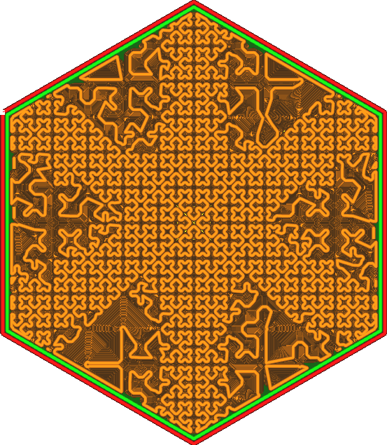

Imagem da densidade de enchimento cruzado
====
Neste parâmetro, você pode fornecer uma imagem que especifica a densidade em diferentes locais do preenchimento.A densidade de enchimento varia em certos lugares, dependendo do brilho da imagem.Isso funciona apenas para o [Cross Motif (3d)](../preenchimento/preléx_pattern.md), porque esse padrão é capaz de ajustar sua densidade sem cortar as linhas, o que resultaria em uma interrupção do fluxo e uma redução de a força.

O caminho para a imagem é fornecido como um caminho local, por exemplo, `C: \ Projects \ 3D Printing \ Infill_Dension.png` em Windows Or`/Home/Ghostkeeper/3D_Printing/Infill_Density.png` UNIX.Os formatos de arquivo suportados são JPG, PNG, TGA, BMP, PSD, GIF, HDR e PIC.A imagem é configurada no objeto para que ela se adapte exatamente à caixa de demarcação do objeto.O brilho da imagem determina a densidade de enchimento:
* Quando a imagem é preta, é usada a [densidade de preenchimento](../preenchimento/refill_sparse_density.md).
* Quando a imagem é branca, a densidade de enchimento é próxima de 0 %.

A densidade de preenchimento nunca excederá o valor especificado pela [distância da linha de enchimento](../prelfill_line_distance.md).Só pode ser reduzido.O modelo também é limitado nos casos em que pode reduzir sua densidade.Embora ele tente chegar o mais próximo possível da densidade de preenchimento desejada, isso nem sempre é possível.Se a densidade de enchimento for realmente baixa, haverá particularmente poucas possibilidades de ajustar a densidade de enchimento, o que significa que a impressão segue a imagem de uma maneira muito solta.Em locais onde a densidade de enchimento é alta, a imagem será seguida de perto.A densidade escolhida também é altamente quantificada.A densidade só pode ser dobrada ou reduzida pela metade, mas Cura [Dither](https://en.wikipedia.org/wiki/dither) o padrão para obter maior precisão efetiva.

Com essa configuração, você pode personalizar seu recheio longe.Como os padrões de enchimento cruzado são usados ​​principalmente com materiais flexíveis, essa configuração é usada para obter restrições muito específicas de suavidade ou dureza.Por exemplo, você pode imprimir uma sola de sapato com suavidade personalizada para se adaptar melhor aos pés ou a um dispositivo mecânico que deve se curvar em partes específicas.

** Este parâmetro não será bem transferido para os arquivos do projeto Cura.O arquivo do projeto gravará o caminho da imagem como um valor de ajuste, mas não armazenará a imagem.Se o arquivo do projeto estiver aberto a outro computador, a imagem de densidade provavelmente não será restaurada. **

