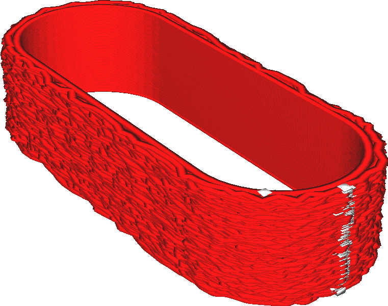

Pela de borrão mágico apenas lá fora
====
Se esse parâmetro for ativado, o efeito [superfícies turvas](Magic_fuzzy_skin_enabled.md) será aplicado apenas às paredes externas da impressão.

Uma pele turva pode ser um efeito agradável para dar textura ao modelo ou aumentar sua adesão, mas destrói completamente qualquer precisão dimensional que você possa esperar da impressão.Isso é um problema se a impressão deve ser montada em algo, como uma alça ou alguns parafusos.Nesse caso, você pode desativar o efeito borrado da pele nos contornos interiores da impressão, limitando -o apenas a lados externos.