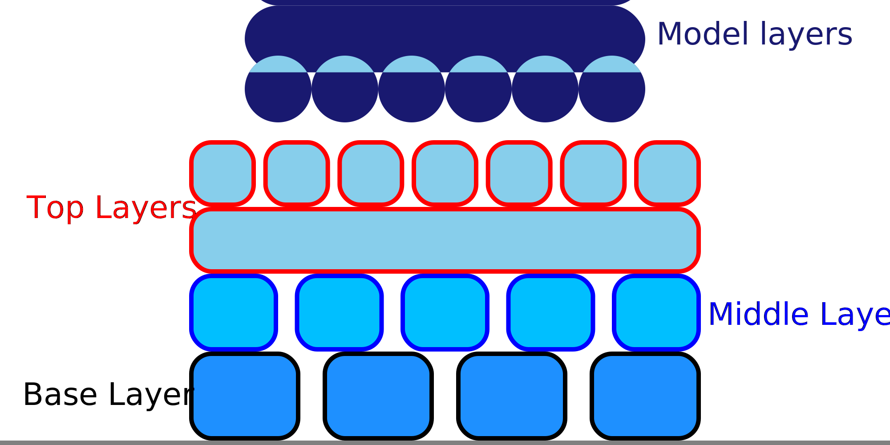

Número de paredes na base da balsa
====
Enquanto uma jangada normalmente consiste apenas em um padrão linear, a camada base da jangada pode ser cercada por paredes adicionais.Eles mantêm o motivo linear no lugar, para que possa aderir melhor à bandeja de impressão.Este parâmetro permite escolher o número de cabos com os quais envolver a camada base da balsa.

Ter pelo menos um cordão é quase sempre uma boa ideia.As linhas da balsa são linhas separadas, com um ponto de partida e um ponto de chegada.As linhas de impressão sem ligar ao lado dos outros tendem a rasgar algumas das linhas de bandeja de impressão quando o bico se mover.Se essas linhas tiverem um ponto de fixação sólido, como um cordão, é menos provável que se separem.

Ter várias paredes ao redor da camada base melhora ainda mais a aderência.Em seguida, começa a se comportar como uma [fronteira](../plataform_adhiction/aderence_type.md).Os cordões adicionais, no entanto, levarão mais tempo para imprimir.Um único cordão é suficiente para a maioria das impressões.