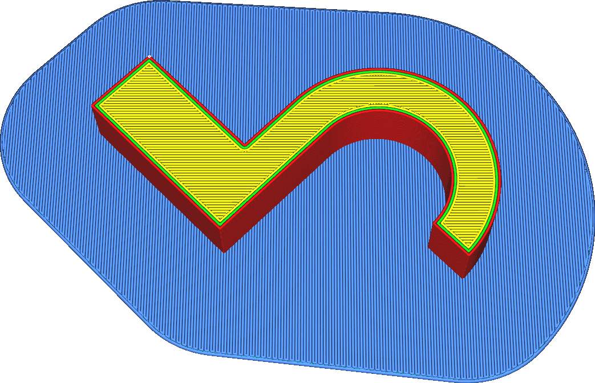

Remova os cantos internos da jangada
====
Quando esse parâmetro é ativado, todos os ângulos internos da jangada são completamente excluídos, transformando a jangada em uma forma [convexa](https://fr.wikipedia.org/wiki/semble_convex).A balsa terá apenas cantos externos.

Isso equivale a ter um [suavização](../plataform_adhiction/raft_smoot.md) muito alto.A remoção dos cantos internos da balsa tem vários efeitos:
* Não é mais possível que uma pequena parte da balsa exceda em muito o restante da balsa.As pequenas partes da balsa têm maior probabilidade de se destacar da bandeja de impressão, em particular com os materiais com uma forte deformação.A abolição dos cantos internos reduz esse efeito, tornando a impressão mais confiável.
* A jangada é maior, o que aumenta a força total de associação na plataforma de impressão.
* A impressão da balsa leva mais tempo e usa mais material.