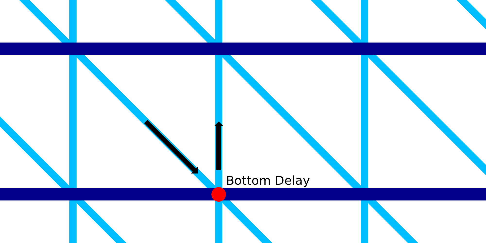

Esperando o fundo da impressão com fio
====
Com essa configuração, o bico para por um momento após a impressão de uma linha diagonal.

Quando o bico é imóvel, ele continua a escorrer um pouco de matéria e produz uma mancha lá.Essa queda ajuda a corrigir o padrão irregular com um anel horizontal abaixo.Melhora a resistência e a confiabilidade da impressão.

No entanto, a adição de um atraso aumenta consideravelmente o tempo de impressão.Existem muitos lugares onde o bico então parará.