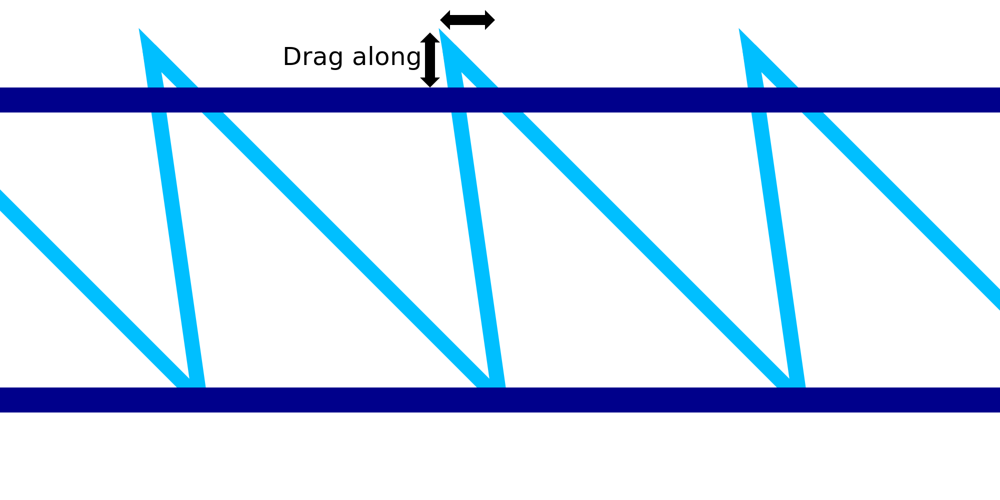

Treinamento de impressão com fio
====
Ao imprimir o movimento diagonal do jato de serra para imprimir sobre o fio, o material tende a ser um pouco arrastado.Esse ajuste compensa esse efeito, transformando levemente a forma do motivo da mandíbula.As pontas dos dentes são trazidas para cima e para trás.

As pontas dos dentes são movidas exatamente o oposto do movimento diagonal.À medida que o material é treinado, esperamos que as pontas dos dentes sawt sejam encontradas no local planejado.

Se o ajuste for bom, o jato de serra é mais preciso.Consequentemente, o seguinte anel horizontal que é colocado no padrão de dente de serra não cederá tanto quanto seria de outra forma.Toda a estrutura se torna mais sólida e a impressão é mais confiável.