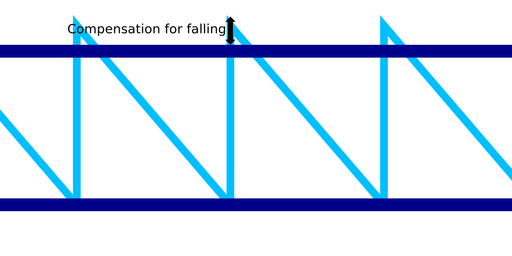

Descendência de impressão de alimentos
====
Ao imprimir o quadro metálico, espera -se que o material ceda devido ao calor latente antes de ter tempo para solidificar.Isso tornaria o padrão da mandíbula muito curto.Enquanto os anéis horizontais são capazes de sobrepostos graças ao movimento horizontal contínuo, o padrão irregular não pode.Esse ajuste compensa o tamanho curto do motivo irregular, tornando o padrão um pouco maior para o próximo anel horizontal repousa corretamente nele.

O valor do ajuste é adicionado à altura dos dentes da serra.Esperamos compensar a flacidez ao imprimir esses dentes.Se estiver bem ajustado, o anel horizontal será impresso, apoiando -se firmemente no desenho dos dentes de Sawt, em vez de cair abaixo da altura impressa.

Quando combinado com [treinamento de impressão com fio](Wireframe_drag_along.md), a altura do jato do dente de serra se torna [altura](Wireframe_Height.md) normal mais o valor do parâmetro de arrasto ao longo do parâmetro mais o valor deste parâmetro.