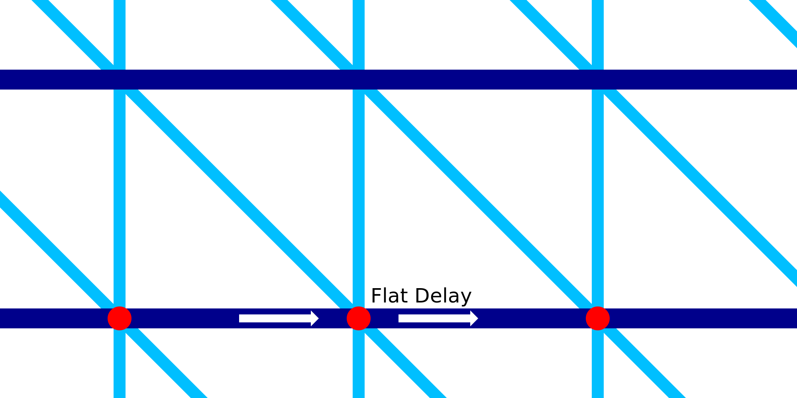

Expectativa horizontal de impressão com fio
====
Durante a impressão dos anéis horizontais da estrutura de metal, o bico para durante uma fração de segundo em cada segmento de linha.Essa configuração permite configurar a duração desta quebra.O intervalo está localizado exatamente onde o anel horizontal é conectado ao padrão de dente de serra que está abaixo.

Ao parar completamente e fazer uma pausa, uma pequena gota de material escorrendo aparecerá nos lugares onde o bico para.A pressão do fluxo de material que sai da sala dos bicos também empurra o anel horizontal ligeiramente para baixo.O anel é, portanto, muito bem preso ao padrão irregular abaixo.

O intervalo aumenta muito o tempo total de impressão.Existem muitos lugares onde o bico é pausado.