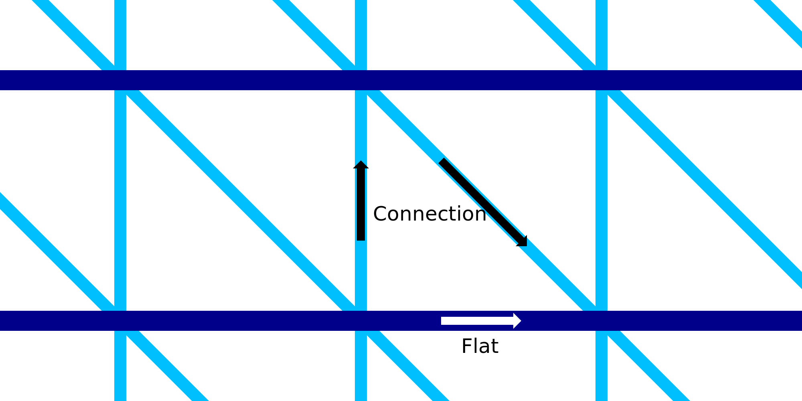

Fluxo de conexão com impressão com fio
====
Essa configuração permite configurar o fluxo (e, portanto, a espessura dos fios) dos fios de conexão ascendentes e descendentes na estrutura da estrutura de metal.Pode ser configurado separadamente dos anéis horizontais.

O aumento do fluxo torna os fios mais espessos.Isso torna as conexões mais rígidas depois de solidificarem.No entanto, isso também aumenta a massa térmica dos fios, o que os torna mais longos para solidificar.Isso reduz a confiabilidade da impressão, porque os fios não podem mais se conectar corretamente.