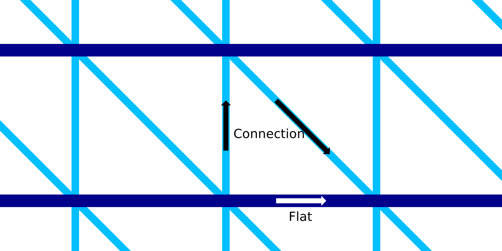

Fluxo de fios planos
====
Essa configuração permite configurar o fluxo (e, portanto, a espessura dos fios) dos anéis horizontais da estrutura da estrutura de metal.Este parâmetro pode ser configurado separadamente da velocidade dos fios de conexão ascendentes e descendentes.

O aumento do fluxo torna os fios mais espessos.Isso torna os anéis horizontais mais rígidos depois de solidificarem.No entanto, isso também aumenta a massa térmica dos anéis horizontais, o que os torna mais solidificados.Os fios estão caídos e a confiabilidade da impressão é reduzida, porque os fios não podem mais se conectar corretamente.