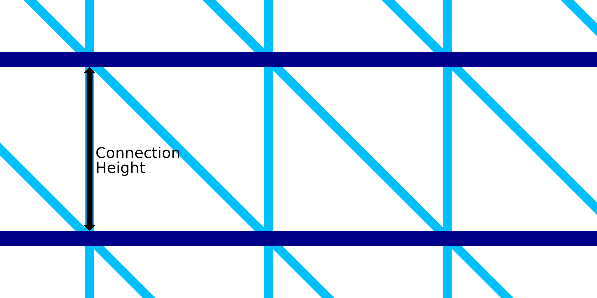

Altura da conexão para impressão com fio
====
A impressão no fio é imprimir vários anéis ao redor do contorno.O espaçamento vertical dos anéis é determinado por esse ajuste.Com essa configuração, você pode definir o comprimento das conexões entre dois anéis concêntricos.

Os anéis são conectados por um padrão de dente de serra.Isso consiste em uma linha vertical e em uma linha diagonal.A linha vertical será exatamente o comprimento da conexão.A linha diagonal será inclinada a 45 °.Consequentemente, esse ajuste não apenas determina a altura vertical entre os anéis, mas também o tamanho horizontal do padrão de dente de serra.Ele determinará a densidade do quadro em geral.

A redução na altura tornará a estrutura densa.Isso tornará o quadro mais estável e tornará a impressão mais confiável.No entanto, a impressão também levará mais tempo.