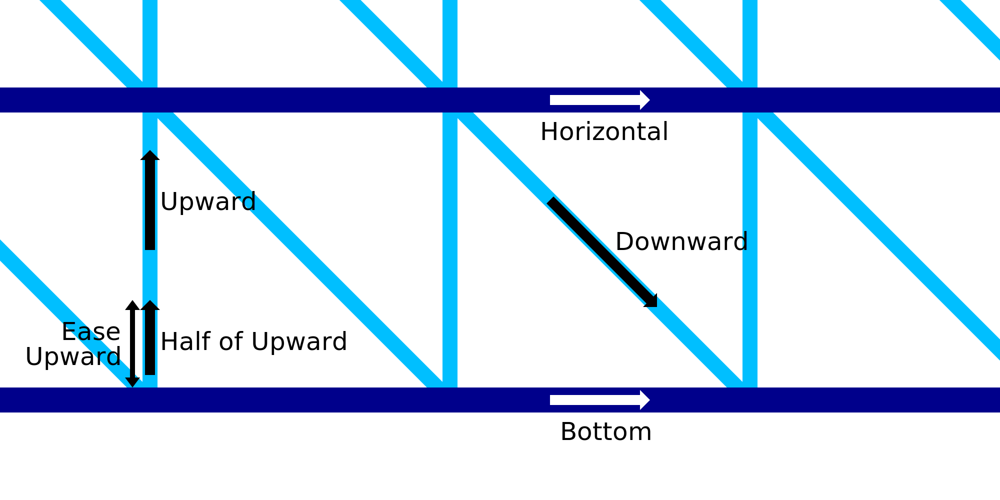

Velocidade de impressão com fio horizontal
====
Esse ajuste especifica a velocidade na qual o bico se move horizontalmente durante a impressão dos anéis horizontais da estrutura de metal.A velocidade das linhas horizontais pode ser configurada separadamente do restante da velocidade de impressão dos fios.

A camada horizontal mais baixa será impressa na [velocidade inferior](Wireframe_printspeed_bottom.md).Isso pode ser configurado separadamente.

Uma impressão mais lenta levará mais tempo, mas dará ao material mais tempo para solidificar.Isso melhora a capacidade de ponte do material, o que torna a impressão mais confiável e mais bonita no final.