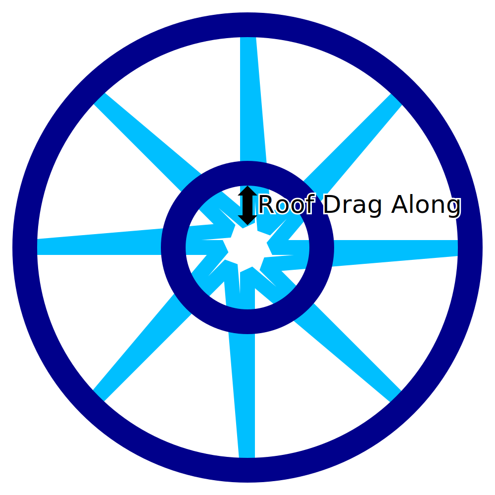

FIR Printing Top Training
====
Ao imprimir plástico derretido, o bico tende a desenhar parte do material ao mesmo tempo que seu movimento, mesmo após sua extrusão.Esse efeito é ainda mais forte durante a impressão externa para o teto da estrutura de metal durante a impressão no modo de impressão de arame.Esse ajuste significa que o jato da queda de serra no topo da impressão continua um pouco mais profundamente para dentro para compensar o fato de ser treinado com o bico.

Esse ajuste causa deslocamento para o interior das extremidades internas do jato da queda de serra da face superior da impressão.Os pontos são movidos na direção exatamente oposta dos diagonais que se movem em direção ao exterior, e não nas linhas que se movem em direção ao interior.

Com um ajuste cuidadoso, o objetivo dessa configuração é melhorar a fixação das pontas internas do padrão irregular com o anel concêntrico que é impresso para repousar sobre eles.