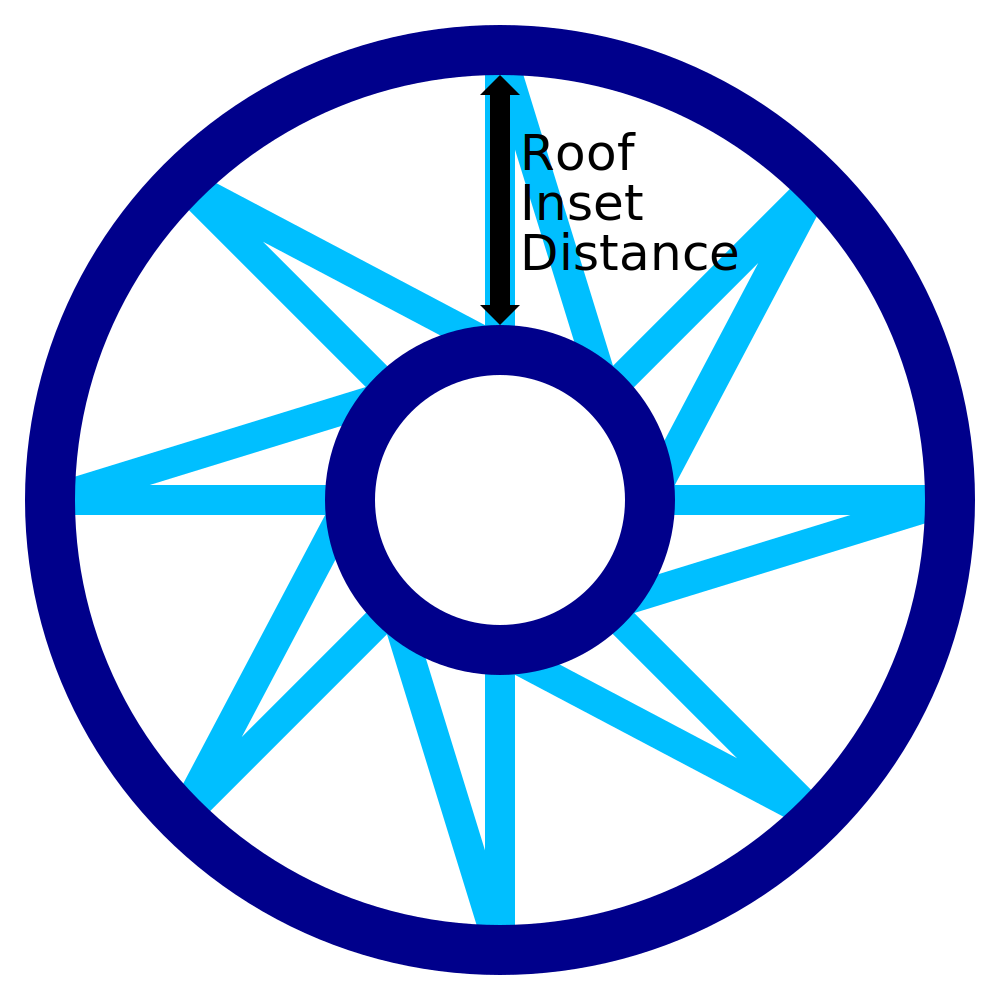

Inserção de telhado para impressões com fio
====
Quando a superfície do modelo é horizontal, por exemplo, a superfície superior do modelo, uma série de anéis concêntricos será impressa e conectada a um padrão irregular.Esse ajuste determina a distância entre esses anéis concêntricos.

Um padrão de dente de serra é desenhado entre cada inserção concêntrica.O padrão de dente de serra não apenas terá a altura indicada por esse ajuste, mas também a largura básica do padrão irregular.A linha diagonal será colocada a uma distância da base da linha reta, conforme indicado por esse ajuste no anel mais interior.Assim, esse ajuste indica a densidade geral do padrão do telhado, e não apenas a distância entre as incorporações.

Ao reduzir esse ajuste, as inserções concêntricas são comparadas e a densidade geral do motivo é aumentada.Isso reduz a distância que o material deve atravessar quando passa sobre o lado superior do modelo.Isso melhora a confiabilidade e aumenta as chances de estabelecer uma conexão correta entre cada inserção.