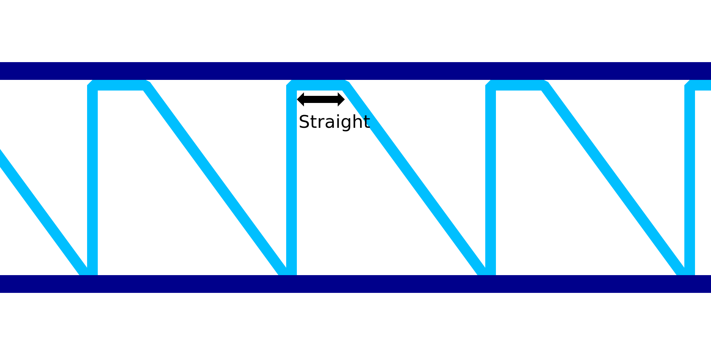

Endireitar as linhas descendentes da impressão com fio
====

Essa configuração é outro fator de compensação que pode ser aplicado para compensar a flacidez do material durante a impressão sobre o fio.Em vez de se mover diretamente diagonal para o jato de serra, esse ajuste fará com que o bico mova horizontalmente para um determinado comprimento do fio e depois se move para baixo.

O objetivo do movimento horizontal certo é puxar o material para cima antes de derrubá -lo.Se for adequadamente ajustado, ele derruba o material na diagonal direita, e não em uma curva caída.Isso torna o padrão da mandíbula mais forte e também permite que as extremidades dos dentes se levantem para apoiar o seguinte anel horizontal.