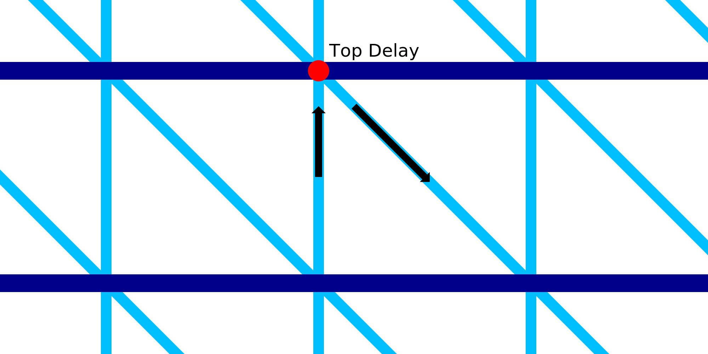

Esperando o topo da impressão com fio
====
Com essa configuração, o bico para por um momento após a impressão de uma linha ascendente.

Enquanto o bico permanece imóvel no topo da linha ascendente, a linha ascendente tem tempo para solidificar.Isso impede que ele seja treinado com o bico quando começa a cair novamente.

Obviamente, a adição de um atraso aumenta consideravelmente o tempo de impressão.Quando parado, o calor do bico também pode derreter o material e escorre de cima.Isso adiciona uma gota de material derretido em uma única linha de filamento, o que torna essa linha um pouco pesada.

Esse ajuste aumenta a impressão de um conglomerado de fatores difíceis de prever.O tempo específico que melhor se adequa ao seu material, sua impressora e seu modelo devem ser determinados experimentalmente.Em geral, o aumento do prazo dentro dos limites razoáveis ​​tende a ter um impacto positivo na confiabilidade da impressão, mas um impacto negativo significativo na velocidade de impressão.