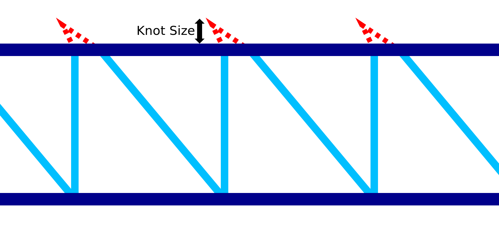

Tamanho do nó com fio
====
Se a [estratégia de impressão de arame](Wireframe_strategy.md) estiver definida como "nó", um pequeno movimento de cima para baixo e de baixo para o topo será feito na parte superior de cada dente de serra.Essa configuração permite configurar a extensão desse movimento.

O movimento para este "nó" é uma série de movimentos de viagem:
1. Primeiro de tudo, o bico se move a partir da distância indicada por esse ajuste.Ao mesmo tempo, o bico se move para trás na metade dessa distância.
2. Se houver um [atraso](Wireframe_top_delay.md) na parte superior, o bico para a duração do conjunto para o conjunto.Essa quebra é feita na ponta do movimento do nó.
3. 3. Terceiro, o bico desce para a altura usual.Ao mesmo tempo, o bico avança o tamanho do nó de uma vez e meio, para se encontrar à distância indicada nesse ajuste em comparação com a linha vertical.

O objetivo do nó é dar ao anel horizontal que o supera uma certa superfície para corrigir o padrão de travamento.O nó varia um pouco de um lado para o outro, de modo que, se o anel horizontal não for colocado com precisão, é ainda mais provável que eles se prendam um ao outro.Além disso, o nó garantirá que a linha ascendente se estenda um pouco mais para cima, o que fará com que o anel horizontal seja empurrado sobre ele.Finalmente, o nó também produzirá uma certa vazamento devido à falta de retração nesse movimento de movimento.Isso produz uma mancha na qual o anel horizontal pode ser melhor.