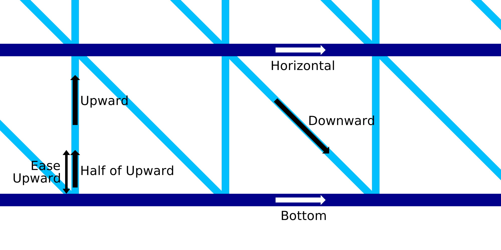

Desvio ascendente da impressão com fio
====
Quando você começa com o movimento ascendente do padrão de dente de serra que conecta os anéis horizontais adjacentes como parte do modo de impressão de arame, o movimento ascendente pode ser lento para a primeira parte da linha vertical.Essa configuração permite configurar a parte da linha vertical que será impressa mais lentamente.Este segmento da linha vertical será impresso na metade da [velocidade ascendente](Wireframe_printspeed_up.md).

Em vez de [fazer uma pausa](Wireframe_bottom_delay.md) na parte inferior, pode ser melhor deixar o bico na marcha.Isso impede que o bico quente redesenhe o anel horizontal abaixo, mas sempre terá o efeito de empurrar firmemente o padrão irregular no anel horizontal.A pressão dentro do quarto do bico empurrará o material para baixo no anel abaixo.

A velocidade na qual o bico se move durante esse comprimento de fio não pode ser configurado separadamente.Sempre será igual a metade da velocidade normal.