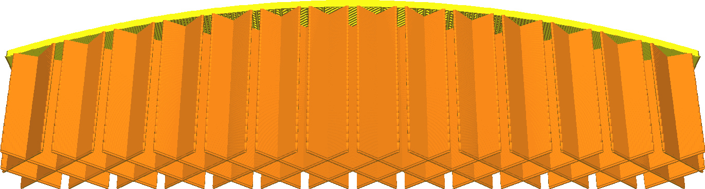

Etapas de enchimento progressivas
====
O enchimento gradual reduz a quantidade de materiais de enchimento utilizados, reduzindo a densidade de enchimento nas camadas inferiores.Isso economiza tempo e material de impressão, apesar de não reduzir muito a qualidade da superfície.O principal objetivo de encher durante a impressão para a qualidade visual é suportar a superfície superior.Essa característica possibilita concentrar o preenchimento para esse único objetivo.

Este parâmetro indica em quantas etapas a densidade de enchimento é reduzida.Em cada estágio, a densidade de enchimento é reduzida pela metade.Por exemplo, começando com uma porcentagem de preenchimento de 20 % e dois estágios graduais de enchimento, a densidade de enchimento das peças inferiores será de 10 % e 5 %, respectivamente.

** O verificação de verificação "gradual de enchimento gradual" no modo recomendado define este parâmetro em 5 etapas e aumenta a densidade de preenchimento de 90 %.Isso leva a uma densidade muito alta no topo (90 %) e a uma densidade muito baixa na parte inferior da sua impressão (2,8 %). **