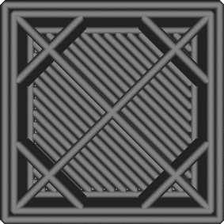

Imprima o recheio antes das paredes
====
Isso afeta a ordem em que as coisas são impressas.Quando esse parâmetro é ativado, o preenchimento de uma peça é impresso antes que as paredes desta sala nesta camada sejam impressas.

Esta configuração é um compromisso entre precisão e força:
* Se as paredes forem impressas antes do enchimento, as paredes podem não ter nada para consertar, o que as faria mais cair.No entanto, as paredes serão solidificadas primeiro e não serão empurradas pelo preenchimento, o que impede o recheio de atravessar as paredes.
* Se o recheio for impresso antes das paredes, as paredes serão empurradas de volta ao local onde o recheio é fixado nas paredes, o que torna as paredes menos precisas e podem trazer o recheio pela superfície, criando assim um padrão visível para o lado de fora.No entanto, o enchimento manterá melhor as paredes no lugar durante a impressão.