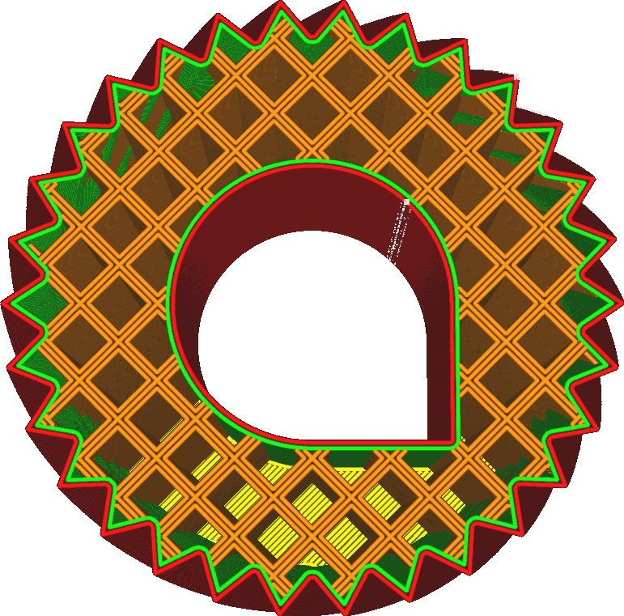

Multiplicador de linha de enchimento
====
Ao aumentar esse parâmetro, a Cura colocará mais linhas de preenchimento diretamente ao lado das outras linhas de preenchimento.

Isso aumenta efetivamente a densidade de enchimento além do que o parâmetro [densidade do enchimento] especifica (Infill_sparse_Dension.md), mas em vez de espaço as linhas de enchimento de uma maneira igual, as linhas são colocadas diretamente ao lado dela.Comparado a um aumento simples da densidade de enchimento, isso pode aumentar a resistência de enchimento, pois as linhas de enchimento podem confiar um no outro para obter mais rigidez.

Quando um multiplicador ímpar é definido, as linhas de enchimento originais permanecem no lugar, mas linhas de enchimento adicionais envolvem os orifícios do modelo de enchimento.Quando um multiplicador de colegas é definido, as linhas de enchimento originais são removidas e os loops são colocados diretamente em seu lugar.

Comparado à alternativa que consiste em aumentar a densidade de enchimento pelo mesmo multiplicador, isso terá alguns efeitos na sua impressão.
* O enchimento se torna mais rígido em geral, assim como o aumento da largura da linha de enchimento, porque as linhas de enchimento podem confiar umas sobre as outras quando estão sujeitas a forças de cisalhamento.
* O enchimento será mais visível através da pele, o que pode reduzir a qualidade da superfície.
* Os espaços entre as linhas de enchimento são maiores, porque as linhas são mais apertadas uma contra a outra.A pele, portanto, se afasta mais se os espaços permitirem que ela ceda.

** Esta configuração não tem efeito se a densidade de enchimento for 100 % ou mais. **