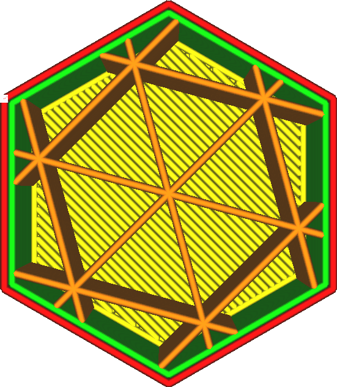

Preenchendo x
====
Normalmente, os modelos de enchimento estão centrados no centro do modelo 3D.Este parâmetro, bem como o [preenchimento y](prelfill_offset_y.md), permite mover o centro do modelo.Este parâmetro permite ajustar a coordenada X do centro.

Durante a impressão com uma baixa densidade de enchimento, você pode usá -la para posicionar o recheio com muita precisão, para que as linhas de enchimento individuais sejam posicionadas onde a resistência é mais necessária.