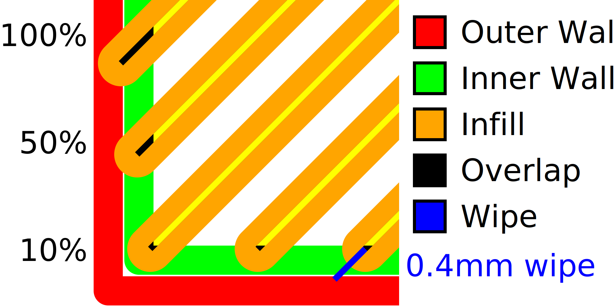

Porcentagem de sobreposição do recheio
====
Se o recheio montar um pouco as paredes, ele aderirá melhor às paredes, o que tornará a sala muito mais sólida.Este parâmetro controla a quantidade de sobreposição das paredes, como uma porcentagem da largura da linha de enchimento.

* O aumento da sobreposição significa que o recheio adere melhor às paredes, o que fornece uma parte mais sólida.
* No entanto, isso também aparecerá o recheio através das paredes, que darão um motivo à superfície da impressão.Isso reduz a qualidade visual da superfície.