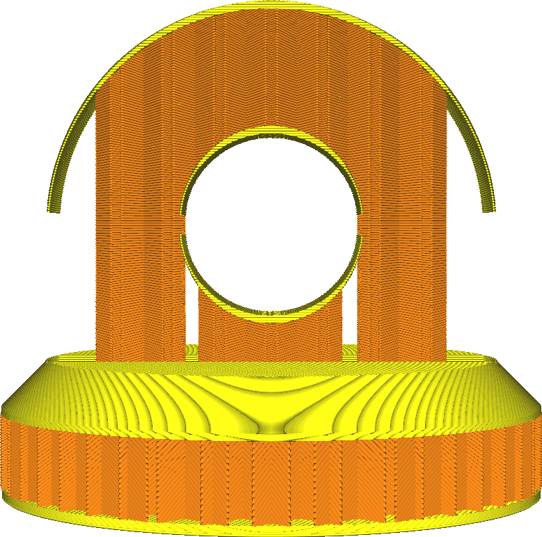

Suporte de preenchimento
====
Quando ativado, este sistema lida com o suporte.O recheio será gerado apenas onde é necessário apoiar a superfície superior.Ele se comporta como se o modelo fosse vazio e gerasse um suporte dentro dele, mas esse suporte é gerado usando os parâmetros de enchimento.

* Isso economiza muito material de enchimento a um custo visual muito baixo.
* As superfícies superiores podem ser um pouco mais oscilantes quando essa função é ativada.
* No entanto, a resistência horizontal do recheio pode ser dizimada.Em muitos casos, não haverá recheio atrás das paredes, se as paredes fizerem parte de uma inclinação íngreme.