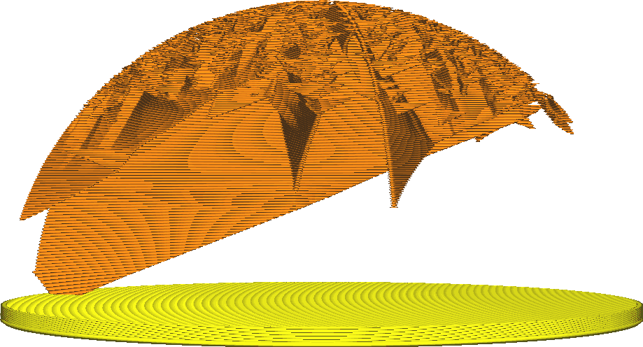

Ângulo de preenchimento do eclair
====
O padrão de enchimento do Eclair produz uma estrutura de árvore dentro da impressão, muito reduzida no início, mas se ramifica para alcançar todas as partes da impressão que devem ser suportadas do interior.Este parâmetro indica em que medida os galhos da árvore podem ser criados com um determinado corpo.

Ao aumentar o ângulo de ramificação, o enchimento pode começar menor de baixo enquanto atinge toda a superfície superior.Em muitos casos, nem é mais necessário começar na parte inferior, basta ficar ao lado.Os principais efeitos do aumento deste ângulo são os seguintes:

* Redução do tempo de impressão e o uso de materiais.
* Paredes lisas, porque não haverá tanto recheio que afeta as paredes interiores.
* Resistência ligeiramente reduzida.
* Mais risco de falha na impressão.Se a saliência for muito importante, haverá uma saliência significativa no final de cada linha, que será caída e poderá se destacar.

Na prática, o ângulo de ramificação pode ser maior que os ângulos de saliência normal ou que os outros [ângulos de projeção do enchimento do eclair](Lightning_infill_overhang_angle.md).Como as linhas são bem suportadas na camada inferior, ter um pouco mais de corpo não é realmente um problema.