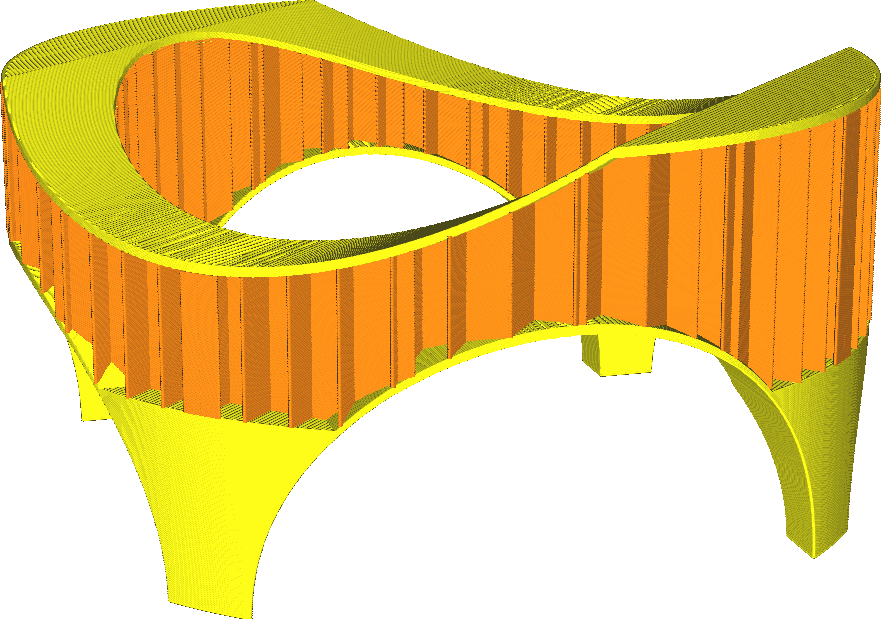

Área de enchimento mínimo
====
Essa configuração significa que peças muito pequenas são preenchidas com o padrão da pele, e não com o padrão de enchimento, o que as torna completamente sólidas.

Às vezes, áreas ocas muito pequenas não podem ser preenchidas adequadamente com material de enchimento, porque as linhas de enchimento seriam tão curtas que o material não teria tempo para fluir corretamente.Esse ajuste os enche de pele, o que os torna mais resistentes e impede a formação de uma separação entre a pele e o material de enchimento.

A configuração deste parâmetro em 0 desativa esta função.