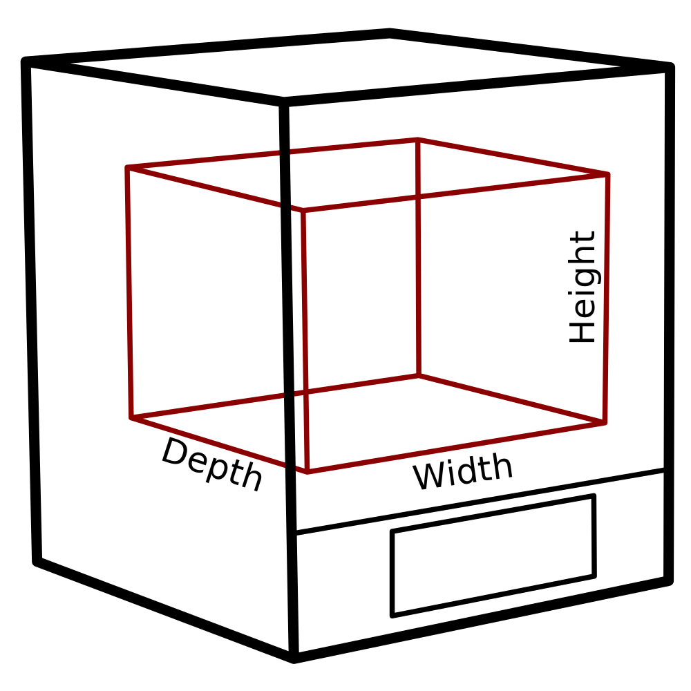

Profundidade da máquina
====
Esse ajuste indica a faixa de coordenadas y através da qual o (s) bico (s) pode se mover.Este é essencialmente o tamanho utilizável da impressora.

Não é igual à profundidade real da sua impressora na prateleira.A impressora real também terá um quadro ou um braço em torno de seu volume de construção, e essa medida não inclui esse tamanho.Esse é apenas o tamanho do volume de construção, as coordenadas onde o bico pode se mover.

Se vários bicos forem afetados, todos os bicos podem não conseguir atingir o volume total da construção.Para algumas impressoras, se a impressora tiver diferentes bicos deslocados em comparação entre si, alguns bicos não poderão atingir todo o volume de produção.Essa configuração simplesmente indica a união de volumes que todos os bocais são capazes de alcançar.

*Como é uma configuração da máquina, normalmente não aparecerá na lista normal de configurações.A profundidade pode ser modificada na caixa de diálogo Parâmetros da impressora, que está na lista de impressoras adicionadas na caixa de diálogo Preferência.*