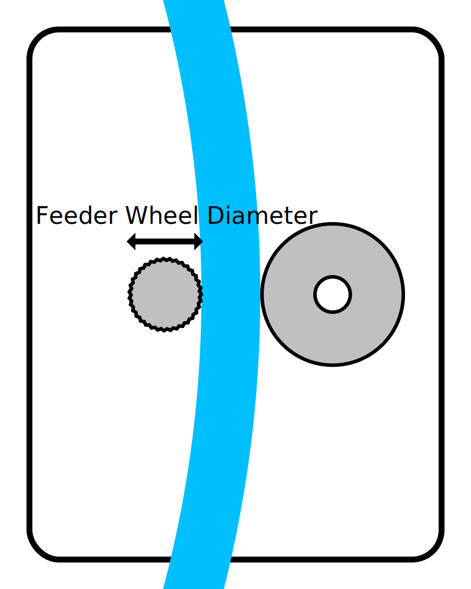

Diâmetro da roda de energia
====
Essa configuração é uma medição do diâmetro da roda, que move o filamento frontal e traseiro dentro da extrusora.

Este parâmetro não é usado por Cura.No entanto, é usado pelo plug-in x3GWriter para controlar adequadamente a extrusora.Ele deve saber como mover a extrusora para mover o filamento para a distância certa.

*Como é um ajuste da máquina, esse ajuste normalmente não é visível na lista de configurações.*