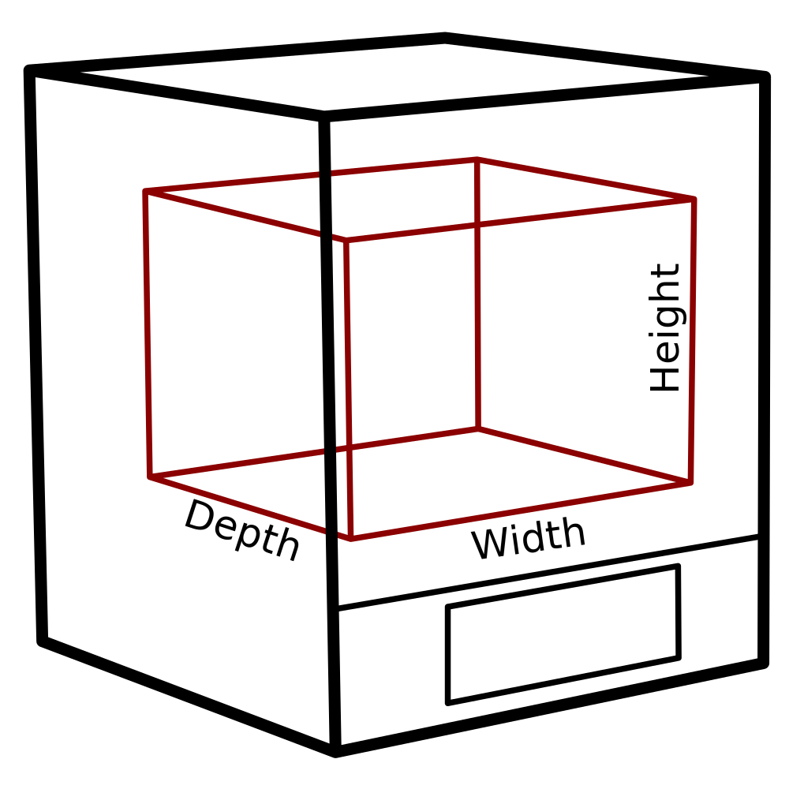

Altura da máquina
====
Esse ajuste indica a faixa vertical de coordenadas z através das quais os bocais (s) podem se mover.Este é essencialmente o tamanho utilizável da impressora.

Não é igual à altura real da sua impressora na prateleira.A impressora real também terá um pórtico ou um braço e uma base ao redor de seu volume de construção, e essa medida não inclui esse tamanho.Esse é apenas o tamanho do volume de construção, as coordenadas onde o bico pode se mover.

*Como é um ajuste da máquina, normalmente não aparecerá na lista normal de configurações.A altura pode ser modificada na caixa de diálogo Configurações da impressora, que está na lista de impressoras adicionadas na caixa de diálogo Preferências.*