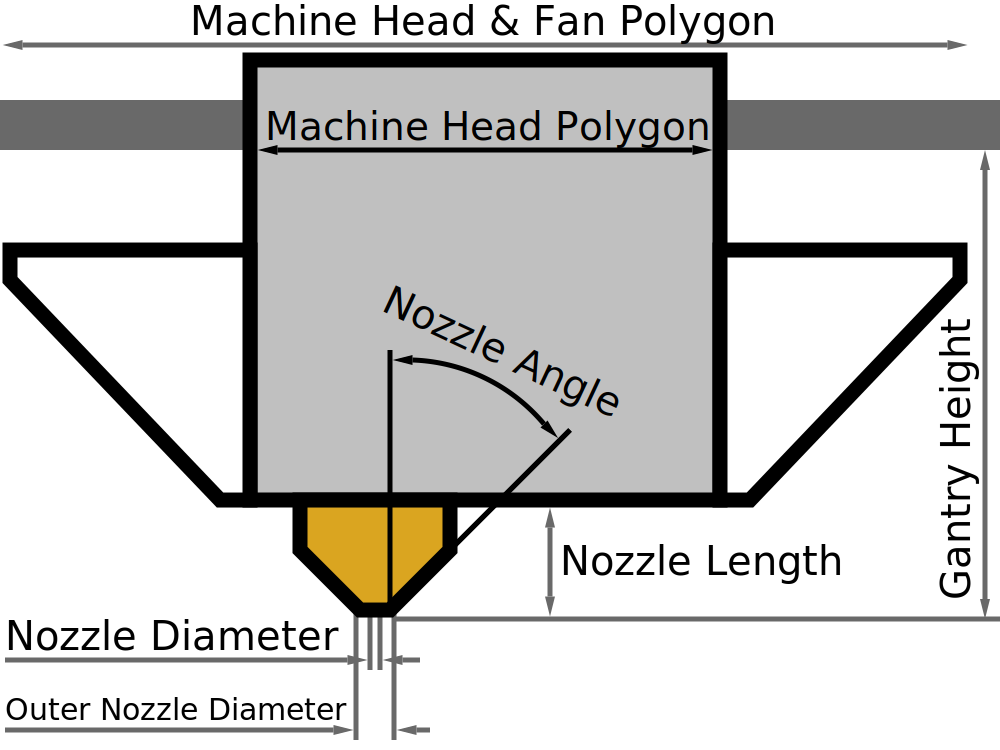

Ângulo do bico
====
Esse ajuste contém uma medição do ângulo da extremidade do bico, em graus.Um ângulo inferior significa que a ponta é muito nítida.Um ângulo mais alto significa que a ponta é truncada.

Este ângulo é usado para determinar a liberação entre quantidades adjacentes ao usar [impressão com fio](../Experience/Wireframe_abled.md).Se o bico for muito curto, as quantidades verticais devem ser amplamente espaçadas para impedir que o bico atinja outras quantidades.

*Como é um ajuste da máquina, esse ajuste normalmente não é visível na lista de configurações.*