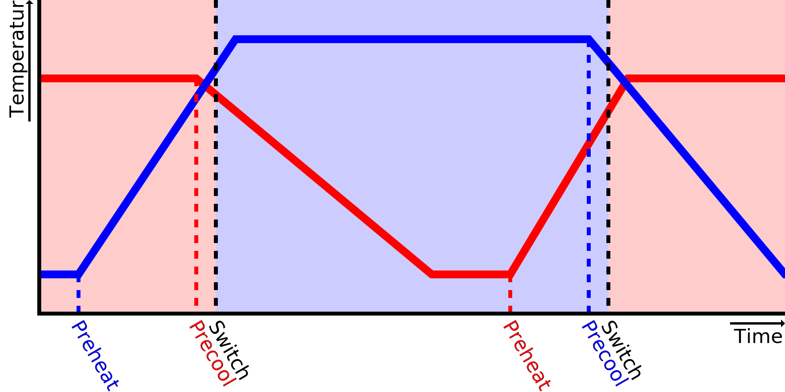

Velocidade de aquecimento
====
Essa configuração indica a cura a rapidez com que sua impressora pode aquecer um bico.É usado para prever quando você precisa começar a pré -aquecer o bico antes de alterar sua extrusora.

Quando ele muda de bico, Cura começa a pré -aquecer o próximo bico antes de ser usada, para que ela esteja pronta para usar quando a outra extrusora acabar de terminar.Para fazer isso, ele levará a diferença entre a temperatura atual do bico e a temperatura alvo do bico e o dividirá pela velocidade de aquecimento, para obter uma duração de pré -aquecimento do bico.

Se o bico realmente esquentar mais rápido do que essa configuração indica, o bico estará na temperatura alvo por um tempo antes que a outra extrusora termine a impressão.Enquanto isso, o material escorre e o plástico pode se degradar um pouco no bico, o que leva a uma [subestrução](../solucionando problemas/underextrusion.md).

Se o bico realmente esquentar mais lentamente do que essa configuração indica, a impressora terá que esperar, no interruptor da extrusora, que o bico atingiu a temperatura desejada para impressão.Vai levar um pouco mais de tempo.Além disso, a extrusora anterior também será mantida na temperatura final de impressão durante essa espera, o que o levará a escorregar mais material e degradar novamente o plástico do bico.Isso é necessário para impedir que o material resfrie mais do que o que o Cura espera durante o fatiamento, o que tornaria a diferença de temperatura mais importante do que o que o Cura esperava e, portanto, causa um período de espera ainda mais na próxima vez.Isso levaria a um efeito de escavação em que a previsão pioraria cada camada, para que o cura deve manter o material quente anterior até que a temperatura do outro ruído seja atingida.

A velocidade real do aquecimento não é um nível constante em graus por segundo.É mais provável que dependa da diferença entre a temperatura atual do bico e a temperatura do volume de construção.Assim, aquecerá mais rápido quando estiver frio e mais lento quando se aproxima da temperatura alvo.O regulador PID da impressora também desempenha um papel importante nesse sentido.A maioria dos reguladores diminui o aquecimento pouco antes de atingir a temperatura alvo para evitar excedê -la.Se você definir este parâmetro, tente ajustá -lo medindo o tempo necessário para passar da [temperatura de espera](../material/material_standby_temperature.md) na [temperatura inicial de impressão](../material/material_initial_print_temperature .md).É a faixa mais importante que o Cura tentará prever.Para impressões pequenas, você pode reduzir ligeiramente a velocidade de aquecimento para ajustar a temperatura inicial não à temperatura de espera, mas a uma temperatura mais alta.

*Como é um ajuste da máquina, esse ajuste normalmente não é visível na lista de configurações.*

