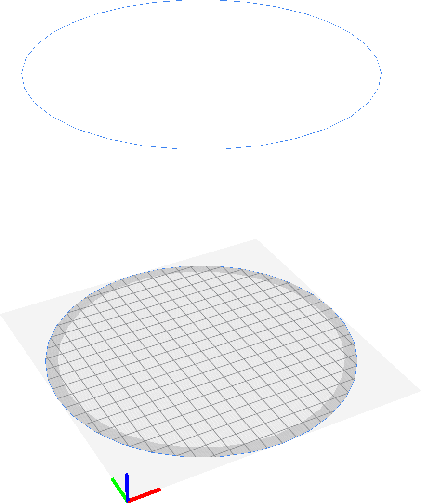

Forma da bandeja
====
Com este parâmetro, você pode indicar o formulário que o volume imprimível leva na sua impressora.Existem duas opções: retangular ou elíptico.

Os volumes de construção elíptica são comuns com impressoras Delta 3D.Se a bandeja de impressão for elíptica, a [largura](Machine_width.md) e a [profundidade](Machine_Depth.md) do volume de construção se aplicam aos dois raios da elipse.A cura reproduz apenas objetos dentro da elipse, para que o volume total de construção seja menor que o de uma bandeja de impressão retangular das mesmas dimensões.

*Essa configuração é uma configuração da máquina, portanto, não aparecerá na lista normal de configurações.Ele pode ser modificado indo para a lista de impressoras na tela de preferência e clicando em "Configurações da máquina".*